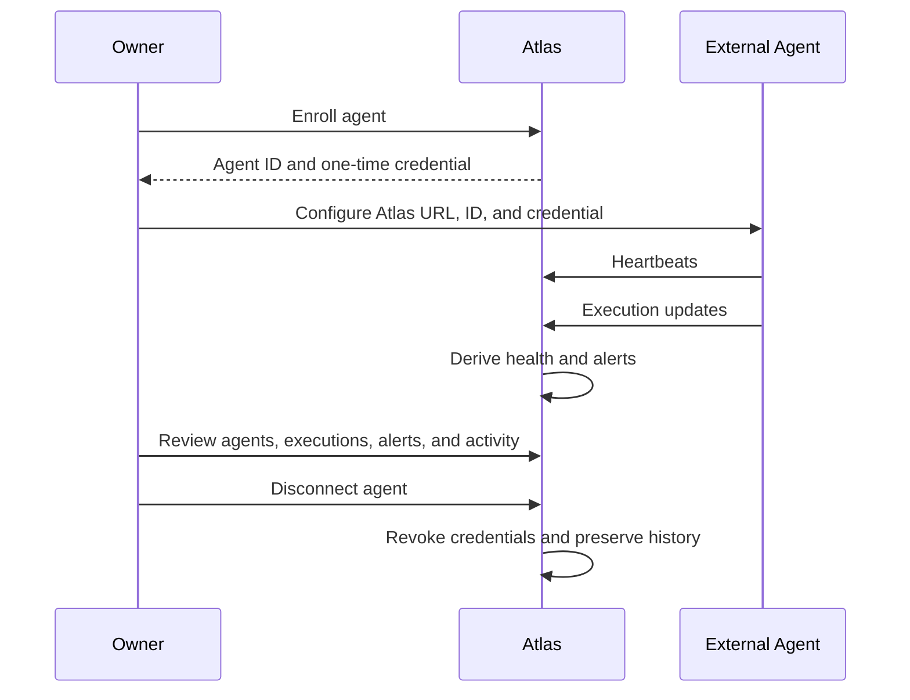

# Atlas

> Visibility, health, alerts, and lifecycle trust for agents you operate elsewhere.

## What Atlas is

Atlas is a single-owner agent visibility and lifecycle control center.

External agents call Atlas's REST API to report heartbeats and executions.
Atlas authenticates each agent, derives connection health, creates alerts, and
retains operational history.

Atlas does not deploy, schedule, execute, pause, resume, stop, or maintain
external agent runtimes in the active MVP.

## Active product direction

The active MVP is governed by:

- [ADR-008](./docs/decisions/ADR-008-atlas-agent-visibility-control-center.md)
- [ADR-009](./docs/decisions/ADR-009-agent-enrollment-and-telemetry-contract.md)
- [Product Requirements](./docs/specifications/atlas-agent-visibility-mvp-requirements.md)
- [Agent Integration API](./docs/specifications/agent-integration-api.md)
- [Target Architecture](./docs/architecture/14-agent-visibility-mvp-target-architecture.md)
- [Product Experience](./docs/design/12-agent-visibility-mvp-experience.md)
- [Reset Plan](./docs/implementation-plans/atlas-agent-visibility-mvp-reset.md)

## Target interaction



## Active MVP surfaces

- Overview
- Agents
- Agent Detail
- Executions
- Alerts
- Activity

## Current implementation

`apps/web` serves a public Atlas landing page at `/` and the authenticated
Agent Visibility MVP under `/control-center`. Active product navigation is
limited to Overview, Agents, Executions, Alerts, and Activity. Legacy prototype
surfaces remain quarantined outside the active navigation.

`apps/api` contains the FastAPI backend foundation, owner identity/session
boundary, PostgreSQL migrations, owner-enrolled agent registry, one-time agent
credential issuance, authenticated heartbeat and execution ingestion, derived
health evaluation, alert lifecycle, material activity, and owner-controlled
lifecycle actions for credential rotation, disconnect, reconnect, and archive.

The repository also retains historical foundations from the former
execution-platform direction, including approvals, connectors, policies,
artifacts, knowledge, Gmail workflows, queues, schedulers, and webhooks. Those
capabilities are dormant or historical for the active MVP unless separately
reactivated through accepted architecture and Work Orders.

ADP-006 has merged WO-064 through WO-070. WO-071 hosted reference-agent
verification is blocked until the production Render API environment is
provisioned with `ATLAS_API_AGENT_CREDENTIAL_PEPPER` and
`ATLAS_API_AGENT_CREDENTIAL_PEPPER_KEY_ID`. Do not record secret values in the
repository, logs, screenshots, pull request text, or chat.

## Repository structure

```text
agent-control-center/
├── apps/
│   ├── api/                  # FastAPI and PostgreSQL backend
│   └── web/                  # Next.js owner dashboard
├── docs/
│   ├── architecture/
│   ├── decisions/
│   ├── design/
│   ├── specifications/
│   ├── engineering-specifications/
│   ├── implementation-plans/
│   ├── work-orders/
│   ├── reviews/
│   └── governance/
├── AGENTS.md
├── PROJECT.md
└── ROADMAP.md
```

## Local frontend

From the repository root:

```bash
npm ci
npm run dev
npm run typecheck
npm run lint
npm test
npm run build
```

## Local backend

```bash
python3 -m venv apps/api/.venv
apps/api/.venv/bin/python -m pip install --upgrade pip
apps/api/.venv/bin/python -m pip install -c apps/api/constraints.txt -e "apps/api[dev]"
apps/api/.venv/bin/python -m pytest apps/api
apps/api/.venv/bin/python -m ruff check apps/api
apps/api/.venv/bin/python -m mypy apps/api/src
cd apps/api
.venv/bin/python -m alembic upgrade head
.venv/bin/python -m alembic downgrade base
```

Alembic migration validation requires a developer-managed PostgreSQL 18
database and an uncommitted `ATLAS_API_DATABASE_URL`; see
[apps/api/README.md](./apps/api/README.md) for the canonical local commands.
GitHub Actions runs the migration smoke check against an ephemeral PostgreSQL 18
service using disposable synthetic CI data.

## Delivery governance

Repository changes follow:

- [Engineering governance](./docs/governance/engineering-governance.md)
- [Definition of Ready](./docs/governance/definition-of-ready.md)
- [Definition of Done](./docs/governance/definition-of-done.md)
- [Pull request and review process](./docs/governance/pull-request-and-review-process.md)

Architecture-changing implementation requires accepted ADRs, an accepted
Engineering Specification, and bounded Work Orders.

## Next implementation gate

WO-071 is the next active gate: hosted reference-agent verification and ADP-006
closeout. It remains blocked until the production API has the required
agent-credential pepper configuration.

## License and intent

This repository is intended for personal use, architectural learning, product
development, and professional portfolio evidence.
