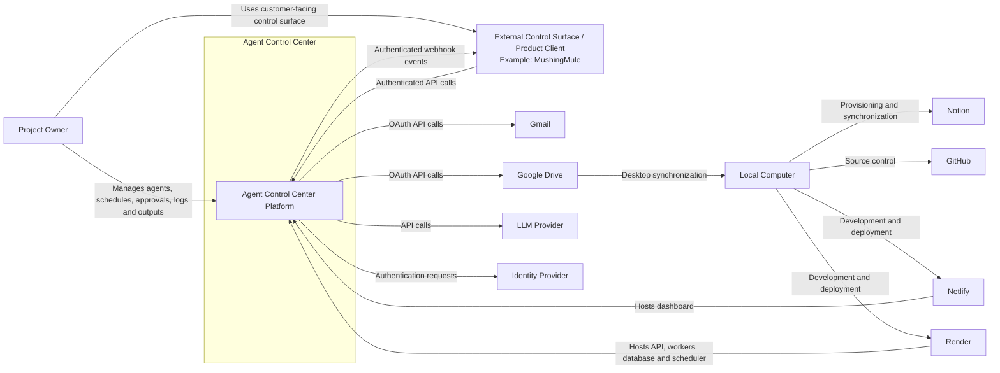

# System Context

## 1. Purpose

This document defines the system context for the Agent Control Center using a C4 Level 1 perspective.

The goal is to show:

- Who interacts with the platform
- Which external systems the platform depends on
- What responsibilities belong inside the Agent Control Center
- Where major trust boundaries exist
- How information flows between the platform and external services

---

## 2. System in Scope

The **Agent Control Center** is a centralized platform for registering, scheduling, executing, monitoring, governing, and auditing AI agents.

The platform provides one management layer for:

- Agent inventory
- Agent configuration
- Scheduling
- Manual execution
- Health monitoring
- Run history
- Logs
- Outputs
- Approvals
- Connectors
- Permissions
- Policies

The platform does not replace Gmail, Google Drive, Notion, or other external systems. It connects to them through controlled integrations.

---

## 3. Primary Actor

### Project Owner

The Project Owner is the initial user and administrator of the platform.

The Project Owner can:

- View all registered agents
- Activate, pause, disable, or run agents
- Configure schedules
- Review health and failures
- Review logs and outputs
- Approve or reject sensitive actions
- Manage connectors and credentials
- Review costs and usage
- Add or configure future agents

The initial solution is single-user. The authorized external-client scope adds
one product client acting for this same human owner and reviewer. It does not
add another human actor or reviewer.

### External Control Surface / Product Client (example: MushingMule)

An External Control Surface / Product Client is a customer-facing system that
uses the governed Atlas API and receives Atlas webhook events on behalf of the
Project Owner. MushingMule is the first example.

The external product client can:

- Read permitted agent and run status.
- Read pending approvals and governed decision evidence.
- Submit approve or reject decisions for the single human reviewer through the
  Approval Service boundary.
- Receive approval-pending and send-outcome webhook events.
- Receive a minimized `message.held_for_manual_handling` event when policy
  suppresses a clinical or protected-health-information message.
- Create, read, update, delete, and confirm governed business facts through the
  generic knowledge API.
- Review stale volatile facts and submit re-confirmations for the one human
  owner.
- Read ask-instead-of-guess questions and submit the one human owner's answers
  without creating an approval or authorization.
- Receive authenticated knowledge question, answer, and fact re-confirmation
  notifications and reconcile authoritative state through the API.

The external product client is not authoritative for Atlas state, approval
validity, governed knowledge, policy, execution, outcomes, or audit evidence.
Atlas must expose a general contract and must not depend on
MushingMule-specific concepts.

---

## 4. Future Actors

Future actors may include:

### Administrator

Manages:

- Platform configuration
- Users and roles
- Connectors
- Policies
- Secrets
- Agent deployment

### Operator

Manages:

- Agent schedules
- Agent status
- Failed runs
- Retries
- Operational issues

### Reviewer

Reviews:

- Approval requests
- Sensitive outputs
- Draft communications
- High-risk actions

### Read-Only User

Can view:

- Agent status
- Run history
- Logs
- Outputs
- Health

but cannot change configuration or approve actions.

---

## 5. External Systems

### 5.1 Gmail

The Agent Control Center connects to Gmail to:

- Read eligible emails
- Retrieve email metadata and content
- Apply labels
- Archive messages
- Create drafts
- Retrieve attachments
- Send messages only after approved workflows are implemented

Authentication:

- OAuth 2.0

Key security concerns:

- Least-privilege scopes
- Refresh token protection
- Sensitive message content
- Prompt injection through email content
- Outbound email approval

---

### 5.2 Google Drive

The Agent Control Center connects to Google Drive to:

- Save attachments
- Create folders
- Store outputs
- Organize generated artifacts
- Support synchronization to a local computer through Google Drive Desktop

Authentication:

- OAuth 2.0

Key security concerns:

- Folder-level access
- External sharing
- File retention
- Sensitive documents
- Malware or unsafe attachments

---

### 5.3 Notion

The Agent Control Center project uses Notion to maintain:

- Project dashboards
- Backlog
- Learning journal
- Architecture decision records
- Build log
- LinkedIn content pipeline
- Progress tracking

The initial Notion connection is used by the repository-based Notion provisioner.

Authentication:

- Internal Notion connection token

Key security concerns:

- Access limited to the designated parent page
- Token protection
- Avoiding destructive synchronization
- Preventing duplicate content

---

### 5.4 LLM Provider

The platform connects to one or more LLM providers to perform:

- Classification
- Summarization
- Draft generation
- Structured decision support
- Tool selection
- Workflow reasoning

Initial provider access will use a direct SDK.

Key security concerns:

- Data minimization
- Sensitive data exposure
- Prompt injection
- Invalid structured output
- Cost controls
- Model availability
- Provider lock-in

---

### 5.5 Identity Provider

A trusted identity provider authenticates the Project Owner.

Potential initial option:

- Google identity

The identity provider confirms who is accessing the dashboard, but the Agent Control Center remains responsible for authorization.

Key security concerns:

- Secure sessions
- Token validation
- Session expiry
- Reauthentication for sensitive actions
- Future role mapping

---

### 5.6 GitHub

GitHub stores:

- Source code
- Architecture documents
- ADRs
- Infrastructure definitions
- Version history
- Future CI/CD workflows

Key security concerns:

- Secret leakage
- Branch protection
- Dependency security
- Access control
- Supply-chain risk

---

### 5.7 Netlify

Netlify hosts the dashboard frontend.

Responsibilities:

- Serve the web interface
- Provide deployment previews
- Deliver static assets
- Route browser requests to the backend API

Netlify must not contain privileged backend credentials.

---

### 5.8 Render

Render hosts the main runtime platform.

Expected services include:

- Backend API
- Background workers
- Scheduler
- PostgreSQL
- Queue or key-value service

Render is part of the trusted hosting boundary but must still be configured using least privilege and environment separation.

---

### 5.9 Local Computer

The Project Owner's local computer is used for:

- Development
- Codex-assisted implementation
- Git operations
- Local testing
- Google Drive Desktop synchronization
- Reviewing downloaded files

The local computer is outside the hosted platform boundary.

Key security concerns:

- Local secrets
- File permissions
- Malware scanning
- Accidental Git commits
- Token storage
- Device compromise

---

## 6. System Context Diagram



---

## 7. Context Relationships

| Source               | Target               | Purpose                       | Data                                  |
| -------------------- | -------------------- | ----------------------------- | ------------------------------------- |
| Project Owner        | Agent Control Center | Manage and review agents      | Commands, approvals, configuration    |
| Project Owner        | External Product Client | Use customer-facing control surface | Review actions and operational state |
| External Product Client | Agent Control Center | Consume governed platform APIs | Agent status, run status, approvals, evidence, decisions |
| Agent Control Center | External Product Client | Deliver governed event notifications | Approval-pending, send-outcome, and held-for-manual-handling webhooks |
| Agent Control Center | Gmail                | Email processing              | Messages, labels, drafts, attachments |
| Agent Control Center | Google Drive         | Store outputs and attachments | Files, folders, metadata              |
| Agent Control Center | LLM Provider         | AI reasoning                  | Prompts, structured inputs, outputs   |
| Agent Control Center | Identity Provider    | Authentication                | Identity claims, session tokens       |
| Local Computer       | Notion               | Provision workspace content   | Pages, databases, records             |
| Local Computer       | GitHub               | Version control               | Source code and documentation         |
| Netlify              | Project Owner        | Deliver dashboard             | Web interface                         |
| Render               | Agent Control Center | Host runtime services         | API, jobs, database operations        |
| Google Drive         | Local Computer       | Sync approved files           | Files and folders                     |

---

## 8. Trust Boundaries

### 8.1 User Device Boundary

Separates:

- Browser
- Local development environment
- Local file system

from hosted services.

Controls:

- Secure browser sessions
- Local secret protection
- Device security
- No privileged credentials in frontend code

---

### 8.2 Frontend-to-Backend Boundary

Separates:

- Netlify-hosted dashboard
- Render-hosted API

Controls:

- TLS
- Authentication
- Authorization
- CSRF protection where applicable
- Input validation
- Rate limiting
- Secure session handling

---

### 8.3 External-Product-Client-to-API Boundary

Separates:

- The external customer-facing product client.
- The Atlas Backend API and authoritative control plane.

Controls:

- TLS.
- Separate external-client authentication.
- Attribution to the single human owner for approval decisions.
- Deny-by-default API scope.
- Request validation, rate limiting, correlation IDs, and idempotency controls.
- Minimum-necessary evidence disclosure.
- Minimum-necessary knowledge and question disclosure.
- Authenticated webhook delivery.
- Audit provenance for external-client activity.
- Prohibited-content validation before knowledge persistence.
- Clinical and protected-health-information suppression before knowledge
  retrieval, question creation, or history learning.

The exact authentication and human-attribution design remains pending in the
Phase 3 and Phase 5 security architecture work required by accepted ADR-004
and proposed ADR-005.

---

### 8.4 Platform-to-External-Service Boundary

Separates the Agent Control Center from:

- Gmail
- Google Drive
- LLM providers
- Notion
- Future connectors

Controls:

- OAuth or scoped tokens
- Least privilege
- Network encryption
- Request validation
- Response validation
- Rate-limit handling
- Connector-specific audit logs

---

### 8.5 Execution-to-Data Boundary

Separates:

- Workers and agent runtime
- PostgreSQL
- Queue
- Secrets

Controls:

- Service credentials
- Encryption
- Restricted network access
- Role-specific database permissions
- Secret references instead of plaintext storage

---

### 8.6 AI Decision-to-Action Boundary

Separates:

- LLM-generated recommendations
- Actual external side effects

Controls:

- Structured output schemas
- Policy validation
- Tool allowlists
- Confidence thresholds
- Human approval
- Idempotency
- Audit logging

This is one of the most important trust boundaries in the solution.

---

## 9. In-Scope Responsibilities

The Agent Control Center is responsible for:

- Agent registration
- Agent configuration
- Schedule management
- Triggering runs
- Tracking execution state
- Managing approvals
- Recording logs
- Recording audit events
- Storing output metadata
- Enforcing permissions
- Enforcing action policies
- Monitoring health
- Coordinating connectors
- Presenting operational information through the dashboard
- Exposing governed platform state and approval operations through an
  authenticated API for one external product client
- Delivering authenticated approval, send-outcome, and held-for-manual-handling
  webhook events

---

## 10. Out-of-Scope Responsibilities

The Agent Control Center is not responsible for:

- Operating Gmail infrastructure
- Operating Google Drive
- Training foundation models
- Replacing external identity providers
- Providing general-purpose cloud storage
- Acting as an antivirus platform
- Guaranteeing external API availability
- Managing the operating system on the user's local computer
- Publishing directly to LinkedIn in the initial phases
- Supporting multiple organizations, multiple external product clients, or
  multi-tenant isolation in the first MVP

---

## 11. Key Data Flows

### 11.1 Manual Agent Run

```text
Project Owner
    |
    v
Dashboard
    |
    v
Backend API
    |
    v
Create Run Record
    |
    v
Queue Job
    |
    v
Worker Executes Agent
    |
    v
External Services
    |
    v
Store Logs and Outputs
    |
    v
Dashboard Displays Result
```

---

### 11.2 Scheduled Agent Run

```text
Scheduler
    |
    v
Identify Due Agent
    |
    v
Create Run Record
    |
    v
Queue Job
    |
    v
Worker Executes Agent
    |
    v
Update Run and Health
```

---

### 11.3 Approval Flow

```text
Agent Proposes Sensitive Action
    |
    v
Policy Engine Flags Approval
    |
    v
Approval Record Created
    |
    v
Project Owner Reviews Request
    |
    +--> Reject
    |
    +--> Approve
             |
             v
        Execute Action
             |
             v
        Record Audit Event
```

---

### 11.4 Attachment Saving Flow

```text
Gmail Message
    |
    v
Attachment Retrieved
    |
    v
Type and Size Validation
    |
    v
Policy Check
    |
    v
Save to Google Drive
    |
    v
Record Output Metadata
    |
    v
Google Drive Desktop Syncs Locally
```

---

## 12. Security Assumptions

The initial architecture assumes:

- The Project Owner controls the connected Gmail and Google Drive accounts.
- The local development computer is trusted and kept secure.
- Netlify and Render are configured using separate environment variables.
- OAuth tokens are never exposed to the browser.
- High-risk actions are not automatically executed in the first MVP.
- The LLM is not trusted to authorize actions by itself.
- One external product client may authenticate to the Atlas API on behalf of the
  same Project Owner who uses the dashboard.
- External-client authentication does not by itself establish the human
  attribution required for an approval decision.
- The external product client is outside the Atlas hosting boundary and is not
  trusted to enforce Atlas authorization, policy, approval, or audit rules.
- The external product client does not receive connector credentials and cannot
  execute connector actions directly.
- External content may be malicious and must be treated as untrusted input.
- Notion access is restricted to the designated project page hierarchy.

---

## 13. Risks at the System Boundary

Key risks include:

- Compromised OAuth tokens
- Prompt injection in emails or documents
- Excessive connector permissions
- Sensitive data sent to an LLM provider
- Unsafe or incorrect agent actions
- Malicious attachments
- External API outages
- Duplicate processing
- Accidental exposure of secrets in Git
- User approval fatigue
- Misconfigured cloud services

These risks will be addressed in the detailed security architecture.

---

## 14. Architecture Decisions Required

The system context identifies several decisions that should become ADRs:

- Dashboard hosting on Netlify
- Runtime hosting on Render
- PostgreSQL as the system of record
- Initial authentication provider
- Gmail OAuth scope strategy
- Google Drive folder strategy
- LLM provider abstraction
- Approval policy model
- Local file synchronization approach
- Control plane and execution plane separation
- Governed external product client contract, accepted in ADR-004

---

## 15. Current Status

- Primary user identified
- Initial external systems identified
- Core system boundary defined
- Major trust boundaries identified
- Initial data flows documented
- Container, component, deployment, security, data, runtime, connector,
  observability, technology, and Human Approvals architecture are documented.
- The governed external approval channel is accepted under ADR-003.
- The general external product client relationship is accepted under ADR-004.
- R8 draft-support knowledge and ask-instead-of-guess behavior is proposed under
  ADR-005 and awaits Architecture and Security Review.
- No backend or external-client contract is implemented.
