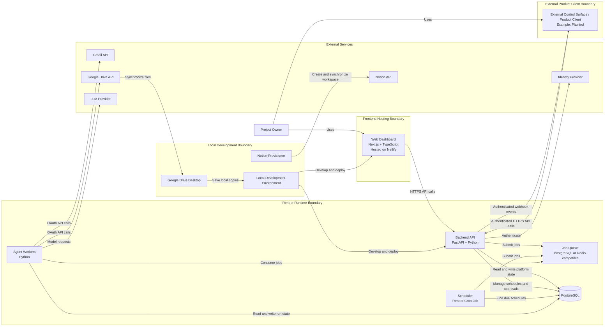
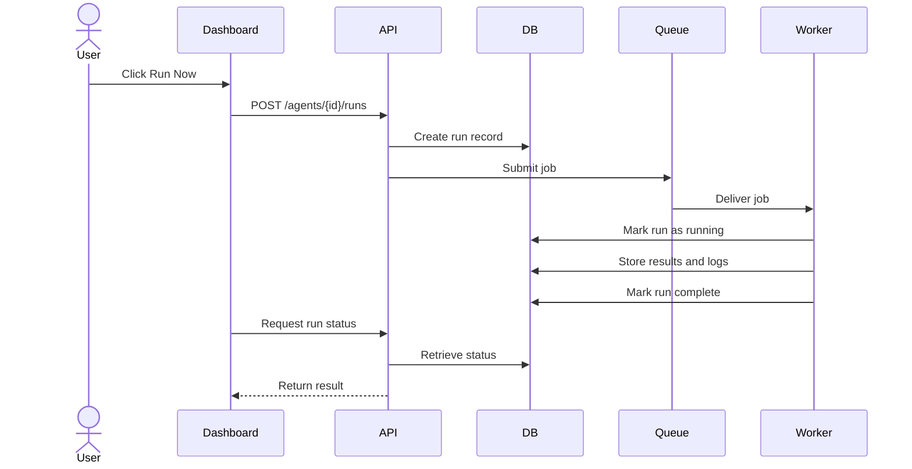
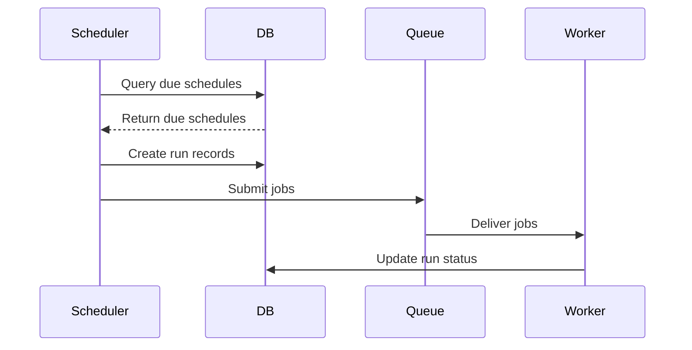
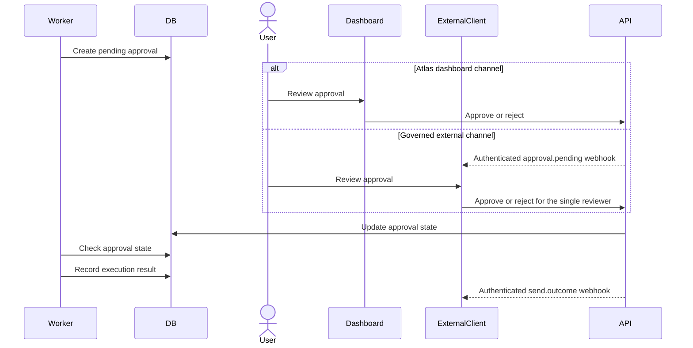

# Container Architecture

## 1. Purpose

This document defines the C4 Level 2 container architecture for the Agent Control Center.

The objective is to describe the major deployable and runtime containers, their responsibilities, interactions, technology choices, and security boundaries.

---

## 2. Architectural Overview

The Agent Control Center is divided into the following major containers:

- Web Dashboard
- Backend API
- Scheduler
- Job Queue
- Agent Workers
- PostgreSQL Database
- Object or File Storage
- External Connectors
- LLM Provider
- Governed External Product Client
- Notion Provisioner
- Local Development Environment

The design separates the control plane from the execution plane.

### Control Plane

The control plane manages:

- Agent definitions
- Configuration
- Schedules
- Status
- Permissions
- Policies
- Approvals
- Logs
- Outputs
- Health
- User access

### Execution Plane

The execution plane performs:

- Agent runs
- Tool invocation
- External API calls
- LLM calls
- File processing
- Action execution
- Retry handling

---

## 3. Container Diagram



---

## 4. Container Inventory

| Container           | Primary Responsibility                 | Technology                                        | Initial Hosting           |
| ------------------- | -------------------------------------- | ------------------------------------------------- | ------------------------- |
| Web Dashboard       | User interface and operational control | Next.js, TypeScript                               | Netlify                   |
| Backend API         | Control plane and business APIs        | FastAPI, Python                                   | Render Web Service        |
| Scheduler           | Identify and trigger due runs          | Python cron process                               | Render Cron Job           |
| Job Queue           | Decouple triggers from execution       | PostgreSQL-backed queue or Redis-compatible queue | Render                    |
| Agent Workers       | Execute agents and actions             | Python                                            | Render Background Workers |
| PostgreSQL Database | System of record for platform state    | PostgreSQL                                        | Render PostgreSQL         |
| File Storage        | Store attachments and outputs          | Google Drive initially                            | Google                    |
| Identity Provider   | Authenticate users                     | Google Identity or equivalent                     | External                  |
| LLM Provider        | Classification and reasoning           | Direct provider SDK                               | External                  |
| External Product Client | Customer-facing governed control surface | Independent product technology                | External                  |
| Notion Provisioner  | Create and maintain project workspace  | TypeScript or Python                              | Local initially           |
| Local File Sync     | Synchronize approved files locally     | Google Drive Desktop                              | Local computer            |

---

## 5. Web Dashboard

### 5.1 Responsibilities

The Web Dashboard provides:

- Agent inventory
- Agent status and health
- Run now
- Activate
- Pause
- Disable
- Schedule management
- Run history
- Logs
- Outputs
- Approval review
- Connector management
- Settings
- Light mode
- Dark mode
- Responsive layouts

### 5.2 Technology

Initial stack:

- Next.js
- TypeScript
- React
- Component library to be selected
- Netlify hosting

### 5.3 Constraints

The dashboard must not:

- Store privileged credentials
- Call Gmail or Google Drive directly
- Execute agents
- Make authorization decisions independently
- Expose OAuth refresh tokens
- Trust client-side validation alone

### 5.4 Security Controls

- HTTPS only
- Secure authentication
- Server-validated sessions
- Authorization enforced by backend
- Content Security Policy
- Input validation
- CSRF protection where applicable
- No secrets in frontend environment variables
- Safe rendering of logs and LLM outputs

---

## 6. Backend API

### 6.1 API Consumer Classes

The Backend API serves two governed consumer classes:

1. The first-party Atlas Web Dashboard.
2. One authenticated external product client acting for the single human owner
   and reviewer.

Plaintrol is the first external product client. The API contract remains generic
and must not expose Plaintrol-specific domain concepts. Both consumer classes
use the same authoritative Atlas services and neither client is trusted to
enforce approval, policy, execution, or audit rules.

### 6.2 Responsibilities

The Backend API acts as the control plane.

It is responsible for:

- User authentication and session validation
- Authorization
- Agent CRUD operations
- Schedule CRUD operations
- Manual run requests
- Run status retrieval
- Approval management
- Output retrieval
- Log retrieval
- Connector management
- Policy enforcement
- Health endpoints
- Administrative operations
- External-client authentication at the API boundary
- Governed external access to agent, run, approval, and evidence state
- Outbound webhook delivery for subscribed platform events

### 6.3 Technology

Initial stack:

- FastAPI
- Python
- Pydantic
- SQLAlchemy
- Alembic
- Render Web Service

### 6.4 API Categories

Expected API groups:

```text
/api/auth
/api/agents
/api/schedules
/api/runs
/api/logs
/api/outputs
/api/approvals
/api/connectors
/api/policies
/api/health
/api/settings
```

The general external-client contract exposes a governed subset of these API
groups. The architecture-level operations include:

```text
GET  /api/agents/{agent_id}
GET  /api/runs/{run_id}
GET  /api/approvals?status=pending
GET  /api/approvals/{approval_id}
POST /api/approvals/{approval_id}/decisions
GET  /api/manual-handling/{hold_id}
```

The approval operations reflect ADR-003. They expose pending requests and
decision evidence, and accept one approve or reject decision for the single
human reviewer. Exact schemas, versioning, pagination, authorization scope,
error contracts, and idempotency requirements remain Phase 3 and Phase 5 design
work.

### 6.5 Outbound Webhook Delivery

The Backend API owns the control-plane boundary for outbound webhook delivery.
Initial external-client event classes are:

- `approval.pending`.
- `send.outcome`, including `Sent`, `Failed`, and `Indeterminate` outcomes
  for approved sends.
- `message.held_for_manual_handling`, containing a governed message reference
  and reason category without a draft, proposed action, or approval identity.

Webhook delivery is an authenticated notification mechanism. It does not
authorize an action and does not replace an authoritative API read. Retry,
ordering, deduplication, subscription lifecycle, delivery persistence, and
reconciliation remain Phase 3 and Phase 5 design work.

### 6.6 Security Controls

- Authentication required by default
- Authorization and policy checks
- Pydantic request validation
- Rate limiting
- Correlation IDs
- Audit logging
- Secure error responses
- No secret values returned
- Idempotency keys for action-triggering operations
- Reauthentication for high-risk operations
- Separate authentication for the external product client
- Human attribution for external approval decisions
- Scoped external-client access with deny-by-default authorization
- Authenticated webhook delivery
- Audit provenance that identifies the external client and decision channel
- Audit provenance that identifies the external delivery channel and hold
  reason for non-approval manual-handling events

The detailed external-client trust model is deferred to the future update of
`07-security-architecture.md` required by accepted ADR-004.

---

## 7. Scheduler

### 7.1 Responsibilities

The Scheduler:

- Queries active schedules
- Determines which schedules are due
- Creates run records
- Submits jobs
- Updates next-run timestamps
- Prevents duplicate schedule execution
- Records scheduling failures

### 7.2 Initial Design

Initial implementation:

- Render Cron Job runs on a fixed cadence
- Scheduler queries PostgreSQL
- Due runs are inserted into the queue
- Database locking or idempotency prevents duplicates

### 7.3 Future Design

Potential migration:

- Temporal schedules
- Event-driven scheduling
- Managed cloud scheduler

### 7.4 Security Controls

- Scheduler has no user-facing endpoint
- Limited database permissions
- No direct access to user credentials unless required
- All generated runs have correlation and trigger metadata
- Duplicate-run protection

---

## 8. Job Queue

### 8.1 Responsibilities

The Job Queue:

- Buffers pending work
- Decouples API and scheduler from workers
- Supports retries
- Supports concurrency
- Tracks delivery state
- Enables worker scaling
- Prevents immediate coupling to external service latency

### 8.2 Initial Options

Option A:

- PostgreSQL-backed queue

Advantages:

- Fewer services
- Lower MVP complexity
- Easier local development

Option B:

- Redis-compatible queue

Advantages:

- Better throughput
- Mature queue libraries
- Lower-latency dispatch

The final choice should be documented through an ADR.

### 8.3 Queue Message Structure

A queue message should contain references, not full sensitive payloads.

Example:

```json
{
  "job_id": "job_123",
  "run_id": "run_456",
  "agent_id": "gmail-triage",
  "trigger_type": "scheduled",
  "requested_by": "user_001",
  "created_at": "2026-07-10T14:00:00Z",
  "idempotency_key": "gmail-triage-2026-07-10T14:00:00Z"
}
```

### 8.4 Security Controls

- Minimal payloads
- No OAuth tokens in messages
- No full email content in messages
- Authenticated queue access
- Dead-letter handling
- Retry limits
- Poison-message detection
- Message expiry

---

## 9. Agent Workers

### 9.1 Responsibilities

Workers execute agent runs.

They:

- Consume jobs
- Load agent definitions
- Load approved configuration
- Retrieve connector references
- Validate permissions
- Call external APIs
- Call LLM providers
- Validate outputs
- Apply policies
- Create approvals
- Execute approved safe actions
- Store outputs
- Record logs
- Update run state
- Update agent health

### 9.2 Runtime Model

Workers should be stateless where practical.

Persistent state belongs in:

- PostgreSQL
- Queue
- External storage
- Workflow engine when introduced

### 9.3 Worker Types

Initial worker type:

- General Agent Worker

Future specialized workers may include:

- Email Worker
- File Processing Worker
- Document Generation Worker
- Browser Automation Worker
- Long-Running Workflow Worker

### 9.4 Security Controls

- Least-privilege service identity
- Limited connector access
- No browser-accessible credentials
- Structured tool interfaces
- Execution timeout
- Memory and CPU limits
- Restricted filesystem access
- Output validation
- Audit logging
- Network egress control where supported

---

## 10. PostgreSQL Database

### 10.1 Responsibilities

PostgreSQL is the system of record for runtime state.

It stores:

- Users
- Roles
- Agents
- Agent versions
- Schedules
- Runs
- Run steps
- Logs
- Approvals
- Outputs
- Connectors
- Credential references
- Policies
- Health checks
- Notifications
- Plugin registrations

### 10.2 Data Ownership

The database owns:

- Agent operational metadata
- Execution history
- Approval state
- Runtime configuration
- Audit references
- Output metadata
- Health state

The database should not become the default storage location for:

- Full email bodies
- Large attachments
- Long-term raw LLM prompts
- Unnecessary personal information

### 10.3 Security Controls

- Encryption at rest
- TLS connections
- Separate credentials by service
- Restricted network access
- Automated backups
- Migration control
- Retention policies
- PII minimization
- No plaintext secrets
- Row-level access patterns if multi-user support is added

---

## 11. External Connectors

### 11.1 Gmail Connector

Responsibilities:

- OAuth authentication
- Read messages
- Retrieve metadata
- Apply labels
- Archive messages
- Create drafts
- Retrieve attachments
- Send only through approved flows

### 11.2 Google Drive Connector

Responsibilities:

- Create folders
- Save attachments
- Save generated outputs
- Return storage references
- Validate destination policies

### 11.3 Notion Connector

Responsibilities:

- Create project pages
- Create databases
- Seed records
- Synchronize Markdown content
- Maintain a provisioning manifest

### 11.4 Connector Contract

Every connector should expose:

- Connector name
- Version
- Authentication method
- Required scopes
- Supported actions
- Risk level by action
- Health check
- Rate-limit handling
- Error model
- Audit metadata
- Data-retention behaviour

---

## 12. LLM Provider Container

### 12.1 Responsibilities

The LLM provider performs:

- Classification
- Summarization
- Drafting
- Structured reasoning
- Tool selection
- Action recommendations

### 12.2 Architectural Position

The LLM provider is an external dependency.

The platform must not assume that:

- The model is always available
- The model output is valid
- The model output is safe
- The model is authorized to act
- The model retains no data unless contractually confirmed

### 12.3 Controls

- Direct provider SDK initially
- Structured output schemas
- Model timeout
- Retry limits
- Cost limits
- Prompt minimization
- Sensitive-data redaction
- Model-response validation
- Provider abstraction where justified

---

## 13. Notion Provisioner

### 13.1 Responsibilities

The Notion Provisioner creates and maintains the AI Architecture Lab workspace.

It:

- Reads local Markdown and configuration
- Creates pages
- Creates databases
- Seeds records
- Maintains object IDs
- Avoids duplicate content
- Supports dry-run and synchronization modes

### 13.2 Deployment Model

Initial deployment:

- Runs locally from the repository

Potential future deployment:

- GitHub Actions
- Render Job
- Controlled administrative workflow

### 13.3 Security Controls

- Token stored in `.env`
- Access restricted to the parent page
- No token logging
- No destructive synchronization by default
- Local manifest
- Explicit confirmation for deletion
- Content-hash based updates

---

## 14. File Storage and Local Synchronization

### 14.1 Initial Approach

Google Drive acts as the initial file storage layer.

Attachments and outputs are stored in approved folders.

Google Drive Desktop synchronizes selected folders to the local computer.

### 14.2 Benefits

- Low implementation complexity
- Familiar user experience
- Built-in synchronization
- Avoids direct local network access from cloud workers
- Supports manual review

### 14.3 Limitations

- Dependency on Google Drive
- Potential sync delays
- Local folder mapping constraints
- Limited malware controls
- Future enterprise scaling concerns

A dedicated object store may be introduced later.

---

## 15. Container Interactions

### 15.1 Manual Run Flow



---

### 15.2 Scheduled Run Flow



---

### 15.3 Approval Flow



---

## 16. Deployment Mapping

| Container          | Environment             | Initial Deployment        |
| ------------------ | ----------------------- | ------------------------- |
| Web Dashboard      | Development, Production | Netlify                   |
| Backend API        | Development, Production | Render Web Service        |
| Scheduler          | Development, Production | Render Cron Job           |
| Agent Workers      | Development, Production | Render Background Workers |
| PostgreSQL         | Development, Production | Render PostgreSQL         |
| Queue              | Development, Production | Render-compatible service |
| External Product Client | External           | Independently deployed     |
| Notion Provisioner | Local initially         | Developer machine         |
| File Sync          | Local                   | Google Drive Desktop      |

---

## 17. Scalability Considerations

The initial architecture is optimized for a single user and a small number of agents.

Future scaling options include:

- Multiple worker processes
- Queue partitioning
- Specialized worker pools
- Read replicas
- Object storage
- Central secrets manager
- Temporal workflows
- Multi-user RBAC
- Per-user connectors
- Multi-tenant isolation
- Usage quotas
- Model routing

---

## 18. Availability and Resilience

Initial resilience measures:

- Database backups
- Worker retries
- Queue durability
- Idempotency keys
- Health checks
- Manual retry
- Connector error handling
- Run timeouts
- Dead-letter handling

Future measures:

- Multi-region services
- Temporal durable workflows
- Automated failover
- Disaster recovery testing
- Service-level objectives

---

## 19. Open Decisions

The following decisions require ADRs:

- PostgreSQL queue versus Redis-compatible queue
- Authentication provider
- Session architecture
- OAuth token encryption
- Component library
- Object storage timing
- Worker concurrency model
- Retry policy
- Log retention
- LLM provider abstraction
- Deployment environment separation
- Notion provisioner implementation language

---

## 20. Current Status

- Major containers identified
- Responsibilities defined
- Control plane and execution plane separated
- Initial deployment mapping defined
- Security responsibilities assigned by container
- Detailed component architecture is documented in
  `05-component-architecture.md`.
- External dashboard and product-client consumer classes are documented, with
  the general external product client contract accepted under ADR-004.
- No backend container or external API contract is implemented.
