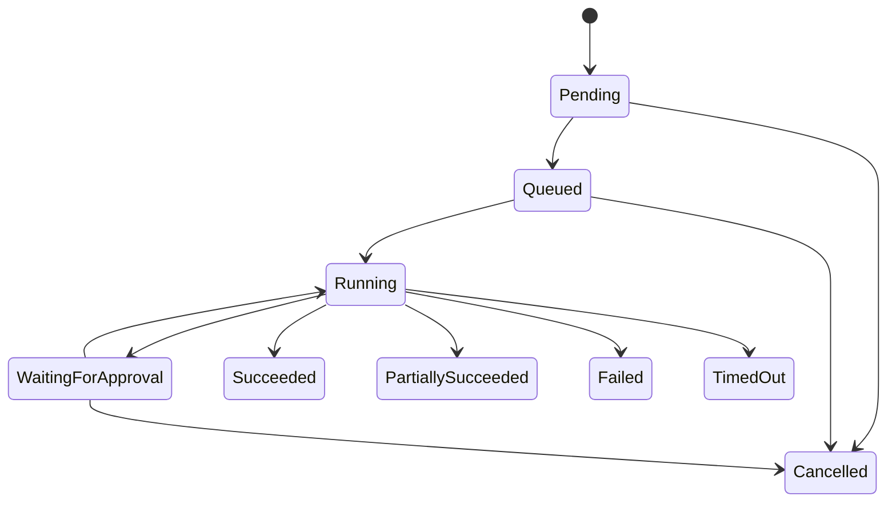
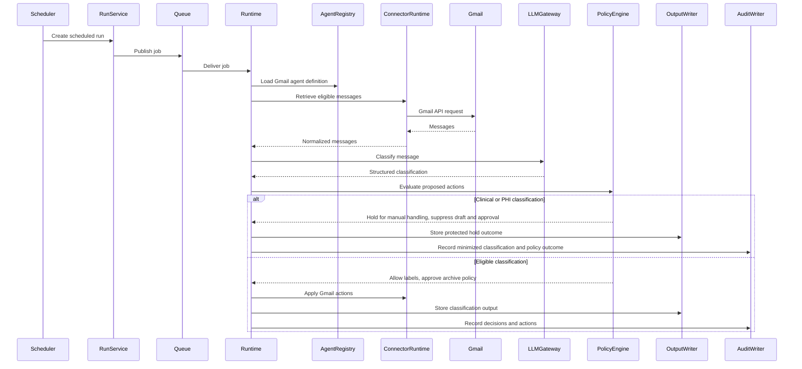

# Component Architecture

## 1. Purpose

This document defines the C4 Level 3 component architecture for the Agent Control Center.

It decomposes the major runtime containers into their internal components and defines:

- Responsibilities
- Interfaces
- Dependencies
- Security controls
- Data ownership
- Failure handling
- Extension points

The initial focus is on the Backend API, Agent Worker, Scheduler, Connector Framework, Approval Service, and Observability components.

---

## 2. Architectural Scope

This document covers components inside:

- Backend API
- Scheduler
- Agent Workers
- Connector Framework
- Policy and Approval Services
- Logging and Audit Services
- Output Management
- Agent Registry
- Notion Provisioner

The Web Dashboard will be decomposed further when detailed UI design begins.

---

## 3. Component Diagram

```mermaid
flowchart TB
    subgraph Dashboard[Web Dashboard]
        UI[Dashboard UI]
        APIClient[API Client]
        AuthClient[Authentication Client]
    end

    subgraph ControlPlane[Backend API / Control Plane]
        APIGateway[API Router]
        AuthService[Authentication Service]
        AuthorizationService[Authorization Service]
        AgentRegistry[Agent Registry Service]
        ScheduleService[Schedule Service]
        RunService[Run Management Service]
        ApprovalService[Approval Service]
        ConnectorService[Connector Management Service]
        PolicyService[Policy Service]
        OutputService[Output Service]
        LogQueryService[Log Query Service]
        HealthService[Health Service]
        NotificationService[Notification Service]
    end

    subgraph ExecutionPlane[Agent Execution Plane]
        Scheduler[Scheduler]
        QueuePublisher[Queue Publisher]
        QueueConsumer[Queue Consumer]
        Runtime[Agent Runtime]
        AgentLoader[Agent Loader]
        ToolRegistry[Tool Registry]
        ConnectorRuntime[Connector Runtime]
        LLMGateway[LLM Gateway]
        ActionValidator[Action Validator]
        ExecutionPolicy[Execution Policy Engine]
        OutputWriter[Output Writer]
        AuditWriter[Audit Writer]
        HealthReporter[Health Reporter]
    end

    subgraph DataLayer[Data Layer]
        RepositoryLayer[Repository Layer]
        Database[(PostgreSQL)]
        Queue[(Job Queue)]
        FileStore[External File Storage]
        SecretStore[Secret Store]
    end

    subgraph ExternalSystems[External Systems]
        Gmail[Gmail]
        Drive[Google Drive]
        LLM[LLM Provider]
        IdP[Identity Provider]
    end

    UI --> APIClient
    AuthClient --> AuthService
    APIClient --> APIGateway

    APIGateway --> AuthService
    APIGateway --> AuthorizationService
    APIGateway --> AgentRegistry
    APIGateway --> ScheduleService
    APIGateway --> RunService
    APIGateway --> ApprovalService
    APIGateway --> ConnectorService
    APIGateway --> OutputService
    APIGateway --> LogQueryService
    APIGateway --> HealthService

    AuthService --> IdP
    AuthorizationService --> PolicyService

    AgentRegistry --> RepositoryLayer
    ScheduleService --> RepositoryLayer
    RunService --> RepositoryLayer
    ApprovalService --> RepositoryLayer
    ConnectorService --> RepositoryLayer
    OutputService --> RepositoryLayer
    LogQueryService --> RepositoryLayer
    HealthService --> RepositoryLayer
    NotificationService --> RepositoryLayer

    Scheduler --> ScheduleService
    Scheduler --> RunService
    Scheduler --> QueuePublisher
    QueuePublisher --> Queue

    Queue --> QueueConsumer
    QueueConsumer --> Runtime
    Runtime --> AgentLoader
    Runtime --> ToolRegistry
    Runtime --> ConnectorRuntime
    Runtime --> LLMGateway
    Runtime --> ActionValidator
    Runtime --> ExecutionPolicy
    Runtime --> OutputWriter
    Runtime --> AuditWriter
    Runtime --> HealthReporter

    ConnectorRuntime --> Gmail
    ConnectorRuntime --> Drive
    LLMGateway --> LLM
    ConnectorRuntime --> SecretStore

    OutputWriter --> FileStore
    OutputWriter --> RepositoryLayer
    AuditWriter --> RepositoryLayer
    HealthReporter --> RepositoryLayer

    RepositoryLayer --> Database
```



---

## 4. Backend API Components

## 4.1 API Router

### Responsibility

The API Router exposes HTTP endpoints and routes requests to application services.

### Responsibilities

- Parse incoming requests
- Validate request structure
- Attach correlation IDs
- Apply authentication middleware
- Apply authorization middleware
- Route requests
- Normalize error responses
- Return response models

### Initial endpoint groups

```text
/api/auth
/api/agents
/api/schedules
/api/runs
/api/approvals
/api/connectors
/api/logs
/api/outputs
/api/policies
/api/health
/api/settings
```

### Security controls

- Authentication required by default
- Pydantic schema validation
- Rate limiting
- Request size limits
- Secure headers
- No secret values in responses
- Consistent error handling
- Correlation ID propagation

---

## 4.2 Authentication Service

### Responsibility

The Authentication Service verifies user identity and manages authenticated sessions.

### Responsibilities

- Redirect to identity provider
- Validate identity tokens
- Create secure application sessions
- Refresh or expire sessions
- Support sign-out
- Require reauthentication for sensitive actions

### Inputs

- Identity-provider token
- Session cookie
- Reauthentication request

### Outputs

- Authenticated user context
- Session state
- Authentication errors

### Security controls

- Secure, HTTP-only cookies
- SameSite protection
- Session expiry
- Token issuer and audience validation
- Clock-skew handling
- No identity-provider tokens stored in browser storage where avoidable

---

## 4.3 Authorization Service

### Responsibility

The Authorization Service determines whether a user may perform a requested action.

### Decision inputs

- User identity
- User role
- Requested resource
- Requested operation
- Agent ownership
- Policy context
- Risk classification

### Example decisions

- May the user activate an agent?
- May the user modify a schedule?
- May the user view an output?
- May the user approve an email send?
- May the user reconnect a Gmail account?

### Initial model

The MVP may initially support a single Owner role, while preserving a role-based interface for future expansion.

### Future roles

- Owner
- Administrator
- Operator
- Reviewer
- Read Only

---

## 4.4 Agent Registry Service

### Responsibility

The Agent Registry Service is the authoritative catalog of available agents.

### Responsibilities

- Register agents
- Update agent metadata
- Retrieve agents
- Enable or disable agents
- Track agent versions
- Validate registration contracts
- Expose capabilities to the dashboard
- Record health status
- Record required permissions
- Record approval policies

### Minimum agent definition

```json
{
  "agent_id": "gmail-triage",
  "name": "Gmail Triage Agent",
  "description": "Classifies and processes eligible Gmail messages.",
  "version": "0.1.0",
  "status": "active",
  "runtime_type": "python",
  "entry_point": "agents.gmail.main:GmailTriageAgent",
  "required_connectors": ["gmail", "google-drive"],
  "required_permissions": ["gmail.read", "gmail.label", "gmail.archive"],
  "risk_level": "medium",
  "approval_policy_id": "gmail-default",
  "configuration_schema_version": "1"
}
```

### Validation rules

- Agent ID must be unique
- Version must be valid
- Entry point must exist
- Required connectors must be registered
- Required permissions must be declared
- Risk level must be defined
- Configuration must match schema

### Extension point

Future agents should appear in the dashboard after successful registration without requiring dashboard code changes.

---

## 4.5 Schedule Service

### Responsibility

The Schedule Service manages recurring and one-time agent schedules.

### Responsibilities

- Create schedules
- Update schedules
- Pause schedules
- Resume schedules
- Delete or retire schedules
- Calculate next-run time
- Validate schedule expressions
- Prevent invalid or excessive frequency
- Associate schedules with agents

### Schedule types

- Manual only
- One-time
- Interval
- Cron-based
- Event-driven in future

### Example schedule

```json
{
  "schedule_id": "schedule_001",
  "agent_id": "gmail-triage",
  "schedule_type": "cron",
  "expression": "0 7 * * *",
  "timezone": "America/Toronto",
  "status": "active",
  "next_run_at": "2026-07-11T11:00:00Z"
}
```

### Security and reliability controls

- Validate time zone
- Validate expression
- Enforce minimum interval
- Prevent duplicate active schedules where prohibited
- Record creator and modifier
- Audit all schedule changes

---

## 4.6 Run Management Service

### Responsibility

The Run Management Service manages the lifecycle of agent runs.

### Responsibilities

- Create run records
- Start manual runs
- Start scheduled runs
- Track state transitions
- Cancel eligible runs
- Retry failed runs
- Retrieve run history
- Prevent duplicate runs
- Maintain correlation and idempotency identifiers

### Run states

```text
Pending
Queued
Running
WaitingForApproval
Succeeded
PartiallySucceeded
Failed
Cancelled
TimedOut
```

### Valid state transitions



### Reliability controls

- Idempotency keys
- Optimistic concurrency
- State-transition validation
- Retry counters
- Timeout timestamps
- Correlation IDs
- Duplicate-run detection

---

## 4.7 Approval Service

### Responsibility

The Approval Service manages actions that require human authorization.

### Responsibilities

- Create approval requests
- Present action details
- Track pending approvals
- Approve
- Reject
- Expire
- Cancel
- Record reviewer
- Resume the associated workflow
- Audit the final outcome

### Approval request example

```json
{
  "approval_id": "approval_123",
  "run_id": "run_456",
  "agent_id": "gmail-triage",
  "action_type": "send_email",
  "risk_level": "high",
  "summary": "Send a reply to recruiter@example.com",
  "status": "pending",
  "expires_at": "2026-07-12T14:00:00Z"
}
```

### Approval safeguards

- Display exact proposed action
- Display destination or recipient
- Display relevant content preview
- Require authenticated reviewer
- Prevent approval after expiration
- Prevent repeated execution
- Require reauthentication for high-risk actions where appropriate

---

## 4.8 Connector Management Service

### Responsibility

The Connector Management Service manages external service connections.

### Responsibilities

- Register connector types
- Initiate OAuth flows
- Store credential references
- Display connection status
- Display authorized scopes
- Revoke connections
- Refresh tokens
- Test connection health
- Track connector errors
- Support reconnection

### Connector states

```text
NotConfigured
Connecting
Connected
Degraded
Expired
Revoked
Error
```

### Security controls

- Never return refresh tokens
- Encrypt credentials
- Show granted scopes
- Support revocation
- Detect expired tokens
- Audit connection changes
- Restrict connector use by agent policy

---

## 4.9 Policy Service

### Responsibility

The Policy Service determines what an agent may do automatically and what requires approval.

### Policy inputs

- Agent
- User
- Connector
- Action type
- Risk classification
- Confidence score
- Data sensitivity
- Recipient or destination
- Previous approvals
- Environment

### Example decision

```json
{
  "decision": "require_approval",
  "reason": "Outbound email requires human approval",
  "policy_id": "gmail-send-policy",
  "risk_level": "high"
}
```

### Policy outcomes

- Allow
- Deny
- Require approval
- Allow with conditions
- Escalate

### Initial policies

- Label email automatically
- Archive approved low-risk categories automatically
- Create drafts automatically
- Send email only after approval
- Delete email only after approval
- Share files externally only after approval

---

## 4.10 Output Service

### Responsibility

The Output Service manages artifacts and structured outputs created by agents.

### Output types

- Draft email
- Summary
- Classification result
- File
- Attachment
- Report
- Link
- Structured JSON
- Generated document

### Responsibilities

- Register output metadata
- Store file references
- Retrieve output details
- Enforce access controls
- Track retention
- Associate outputs with runs
- Prevent unsafe inline rendering

### Output metadata example

```json
{
  "output_id": "output_001",
  "run_id": "run_456",
  "type": "saved_attachment",
  "name": "invoice-july.pdf",
  "storage_provider": "google-drive",
  "storage_reference": "drive-file-id",
  "created_at": "2026-07-10T14:15:00Z",
  "sensitivity": "confidential"
}
```

---

## 4.11 Log Query Service

### Responsibility

The Log Query Service provides controlled access to operational logs and audit records.

### Responsibilities

- Retrieve logs by run
- Filter by severity
- Filter by component
- Filter by time
- Retrieve audit events
- Redact sensitive values
- Support pagination
- Export approved log sets in future

### Log classes

- Operational log
- Security log
- Audit event
- Model trace
- Connector trace
- Performance metric

### Security controls

- Redaction
- Role-based access
- No secrets
- No full email bodies by default
- Controlled retention
- Tamper-evident audit strategy in future

---

## 4.12 Health Service

### Responsibility

The Health Service summarizes platform and agent health.

### Health dimensions

- API health
- Database health
- Queue health
- Worker health
- Scheduler health
- Connector health
- Agent health
- LLM provider health

### Health states

```text
Healthy
Degraded
Unhealthy
Unknown
Disabled
```

### Example health response

```json
{
  "status": "degraded",
  "components": {
    "database": "healthy",
    "queue": "healthy",
    "gmail_connector": "degraded",
    "worker": "healthy"
  }
}
```

---

## 4.13 Notification Service

### Responsibility

The Notification Service informs the user about significant events.

### Initial events

- Agent failure
- Approval requested
- Connector expired
- Scheduled run missed
- Repeated retry failure
- High-risk action completed

### Initial delivery options

- Dashboard notification
- Email notification later
- Mobile push later

The Notification Service should not become a dependency for successful agent execution.

---

## 5. Scheduler Components

## 5.1 Due Schedule Evaluator

### Responsibility

Find active schedules whose next-run time has arrived.

### Controls

- Database locking
- Time-zone normalization
- Clock-skew tolerance
- Duplicate selection prevention

---

## 5.2 Run Creator

### Responsibility

Create a run record for each due schedule.

### Required metadata

- Agent ID
- Schedule ID
- Trigger type
- Trigger timestamp
- Correlation ID
- Idempotency key

---

## 5.3 Queue Publisher

### Responsibility

Publish a job reference to the execution queue.

### Failure handling

- Retry transient queue failures
- Mark run as failed if publication cannot succeed
- Avoid duplicate publication
- Record queue message ID

---

## 5.4 Next-Run Calculator

### Responsibility

Calculate and persist the next scheduled execution time.

### Requirements

- Time-zone aware
- Daylight-saving aware
- Deterministic
- Independently testable

---

## 6. Agent Worker Components

## 6.1 Queue Consumer

### Responsibility

Receive work from the queue and establish execution context.

### Responsibilities

- Validate job schema
- Claim job
- Enforce visibility timeout
- Load run record
- Detect duplicate delivery
- Start execution

---

## 6.2 Agent Runtime

### Responsibility

Coordinate the complete execution of an agent run.

### Execution sequence

1. Load run
2. Load agent
3. Validate status
4. Validate configuration
5. Resolve connectors
6. Load policies
7. Execute agent
8. Validate proposed actions
9. Execute safe actions
10. Create approvals where required
11. Store outputs
12. Record audit events
13. Update health
14. Complete run

### Runtime constraints

- Maximum run duration
- Maximum tool calls
- Maximum model calls
- Maximum cost
- Cancellation checks
- Retry policy
- Memory limits

---

## 6.3 Agent Loader

### Responsibility

Resolve the registered agent definition to an executable implementation.

### Responsibilities

- Validate agent version
- Load entry point
- Verify interface compliance
- Load configuration schema
- Reject unsupported runtime types

### Future support

- Python agents
- LangGraph workflows
- Temporal workflows
- External agent services

---

## 6.4 Tool Registry

### Responsibility

Maintain the approved set of tools available to agents.

### Tool examples

- Read Gmail message
- Apply Gmail label
- Archive Gmail message
- Create Gmail draft
- Save file to Google Drive
- Retrieve calendar availability

### Tool definition

Each tool should declare:

- Tool ID
- Description
- Input schema
- Output schema
- Connector dependency
- Required permission
- Risk level
- Idempotency behavior
- Timeout
- Audit requirements

### Security principle

An agent may use only tools explicitly assigned to it.

---

## 6.5 Connector Runtime

### Responsibility

Provide controlled access to external systems during agent execution.

### Responsibilities

- Resolve credential reference
- Acquire valid access token
- Apply rate-limit handling
- Execute connector operation
- Normalize external errors
- Record connector telemetry
- Redact sensitive values

---

## 6.6 LLM Gateway

### Responsibility

Provide a controlled interface to one or more LLM providers.

### Responsibilities

- Select model
- Build request
- Apply prompt template
- Minimize data
- Enforce structured output
- Validate response
- Track token usage
- Track cost
- Handle timeout and retry
- Record model metadata

### LLM request metadata

- Provider
- Model
- Prompt version
- Input token estimate
- Output token count
- Latency
- Cost estimate
- Response validation result

### Security controls

- No direct action authority
- Structured schemas
- Prompt injection defenses
- Sensitive-data minimization
- Provider allowlist
- Maximum token budget
- Output validation

---

## 6.7 Action Validator

### Responsibility

Validate all proposed actions before execution.

### Validation dimensions

- Schema validity
- Required permissions
- Supported tool
- Target resource
- Data sensitivity
- Risk level
- Confidence score
- Policy compliance
- Idempotency
- Approval status

### Principle

LLM output is treated as untrusted input.

---

## 6.8 Execution Policy Engine

### Responsibility

Determine whether a validated action may proceed.

### Outcomes

- Execute
- Deny
- Require approval
- Defer
- Escalate
- Hold for manual handling

The Execution Policy Engine is distinct from the LLM and has final authority over action execution.

### Gmail Clinical and PHI Suppression

For the Phase 6 Gmail agent, the Execution Policy Engine must treat an inbound
message classified as clinical or as containing protected health information
as ineligible for automatic drafting. The authoritative outcome is hold for
manual handling, not require approval.

The Gmail agent must not create a draft, proposed send action, or approval
request for the suppressed message. Approval cannot override this outcome. The
classification and policy outcome must be auditable using minimum necessary
metadata without copying protected content into logs or general audit events.

The future Gmail Agent and Policy Engine Engineering Specifications must define
classification contracts, confidence and uncertainty behavior, hold lifecycle,
manual-handling routing, audit metadata, privacy controls, and verification
evidence. This architecture requirement does not authorize implementation.

---

## 6.9 Output Writer

### Responsibility

Persist structured outputs and file references.

### Responsibilities

- Write metadata to PostgreSQL
- Save files to approved storage
- Classify sensitivity
- Apply retention policy
- Associate output with run and agent
- Produce dashboard-accessible references

---

## 6.10 Audit Writer

### Responsibility

Write immutable or append-only audit events for material activity.

### Audit event example

```json
{
  "event_type": "gmail_message_archived",
  "actor_type": "agent",
  "actor_id": "gmail-triage",
  "run_id": "run_456",
  "resource_type": "gmail_message",
  "resource_id_hash": "hashed-message-reference",
  "decision": "allowed",
  "policy_id": "archive-low-risk",
  "timestamp": "2026-07-10T14:20:00Z"
}
```

---

## 6.11 Health Reporter

### Responsibility

Update operational health based on execution results.

### Inputs

- Run outcome
- Failure type
- Connector state
- Retry count
- Recent success rate
- Response latency

### Example health rules

- One transient failure: remain healthy
- Repeated connector failure: degraded
- Repeated agent crashes: unhealthy
- Disabled agent: disabled

---

## 7. Repository Layer

## 7.1 Responsibility

The Repository Layer provides controlled data access between services and PostgreSQL.

### Repositories

- UserRepository
- AgentRepository
- ScheduleRepository
- RunRepository
- ApprovalRepository
- ConnectorRepository
- OutputRepository
- LogRepository
- PolicyRepository
- HealthRepository

### Principles

- No raw SQL in API routes
- Transaction boundaries are explicit
- Domain services do not depend directly on database details
- Repository methods are testable
- Sensitive fields are handled consistently

---

## 8. Notion Provisioner Components

## 8.1 Workspace Configuration Loader

Reads:

- Workspace hierarchy
- Page definitions
- Database definitions
- Seed data
- Icons
- Source Markdown paths

---

## 8.2 Markdown Parser

Converts Markdown into supported Notion block structures.

Supported content should include:

- Headings
- Paragraphs
- Lists
- Checklists
- Code blocks
- Quotes
- Dividers
- Links
- Tables where practical

---

## 8.3 Page Builder

Creates and updates Notion pages.

### Responsibilities

- Create page hierarchy
- Apply titles and icons
- Append content blocks
- Detect existing pages
- Avoid duplicates

---

## 8.4 Database Builder

Creates Notion databases and data sources.

### Responsibilities

- Create properties
- Create relations
- Seed records
- Validate schema
- Track IDs

---

## 8.5 Manifest Manager

Stores mappings between logical names and Notion identifiers.

### Manifest contents

- Page IDs
- Database IDs
- Data-source IDs
- Content hashes
- Last synchronization time
- Parent page ID

---

## 8.6 Synchronization Engine

Compares local source content with the Notion workspace.

### Behaviors

- Dry run
- Create missing content
- Update changed content
- Skip unchanged content
- Never delete by default
- Report unsupported formatting

---

## 9. Cross-Cutting Components

## 9.1 Configuration Service

Manages non-secret runtime configuration.

Examples:

- Feature flags
- Timeouts
- Retry limits
- Model selection
- Schedule limits
- Retention settings

---

## 9.2 Secret Resolver

Resolves secret references without exposing secret values to unrelated components.

Examples:

- OAuth refresh token
- LLM API key
- Encryption key
- Webhook secret

---

## 9.3 Correlation Context

Propagates identifiers across:

- Dashboard request
- API call
- Run
- Queue message
- Worker execution
- Connector call
- LLM call
- Audit event

---

## 9.4 Error Normalization

Converts internal and external failures into a consistent platform error model.

### Error categories

- Validation
- Authentication
- Authorization
- Connector
- Rate limit
- LLM
- Queue
- Database
- Timeout
- Policy denial
- Configuration
- Internal

---

## 10. Component Interaction: Gmail Classification Run



---

## 11. Component Security Model

| Component              | Main Security Responsibility         |
| ---------------------- | ------------------------------------ |
| Authentication Service | Verify identity                      |
| Authorization Service  | Enforce user permissions             |
| Agent Registry         | Declare capabilities and permissions |
| Connector Service      | Protect and govern external access   |
| Policy Service         | Govern allowed actions               |
| Approval Service       | Capture human authorization          |
| LLM Gateway            | Control and validate model use       |
| Action Validator       | Treat AI output as untrusted         |
| Audit Writer           | Preserve traceability                |
| Secret Resolver        | Protect credentials                  |
| Output Service         | Protect generated artifacts          |
| Repository Layer       | Enforce controlled data access       |

---

## 12. Component Testing Strategy

Each component should support isolated testing.

### Unit tests

- Schedule calculation
- Policy evaluation
- State transitions
- Agent registration validation
- Action validation
- Markdown parsing
- Error normalization

### Integration tests

- API to PostgreSQL
- Scheduler to queue
- Queue to worker
- Worker to connector sandbox
- OAuth callback
- Notion provisioning
- Output storage

### Contract tests

- Agent contract
- Connector contract
- Tool contract
- Queue message schema
- LLM structured output schema
- API response schemas

### End-to-end tests

- Manual Gmail-agent run
- Scheduled Gmail-agent run
- Approval flow
- Connector expiration
- Failed run retry
- Attachment save flow

---

## 13. Component Evolution Strategy

The MVP should begin with explicit components implemented within a modular monolith.

This avoids premature microservices while preserving clear boundaries.

### Initial deployment

- One FastAPI application
- One scheduler process
- One worker process
- One PostgreSQL database
- One queue implementation

### Future extraction candidates

Components may become separate services when justified by:

- Independent scaling
- Security isolation
- Different runtime requirements
- Independent deployment cadence
- Operational criticality

Likely future candidates:

- Agent Worker service
- Approval service
- Connector service
- Notification service
- Observability pipeline

---

## 14. Open Decisions

The following component-level decisions require further analysis:

- Dependency-injection approach
- Repository pattern implementation
- Queue library
- Policy representation
- Agent plugin loading
- LLM gateway abstraction
- Secret-encryption method
- Audit immutability strategy
- Notification mechanism
- Dashboard state-management approach
- Modular monolith package boundaries

These decisions should be captured as ADRs before implementation.

---

## 15. Current Status

- Major control-plane components defined
- Major execution-plane components defined
- Data-access components defined
- Security responsibilities assigned
- Agent execution interaction documented
- Initial modular-monolith strategy established
- Deployment and security architecture baselines are documented.
- Clinical and protected-health-information suppression is defined as a Policy
  Engine hold outcome with no draft or approvable action.
- Backend components remain architecture only and are not implemented.
