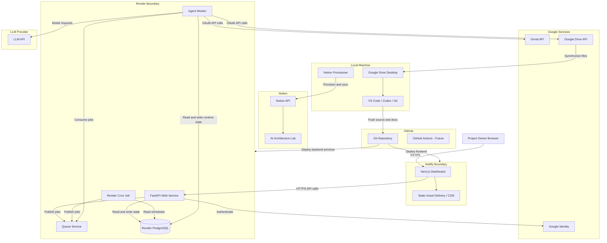

# Deployment Architecture

## 1. Purpose

This document defines how the Agent Control Center is deployed across local development, Netlify, Render, and external service providers.

It describes:

- Deployment environments
- Runtime topology
- Network flows
- Service boundaries
- Environment isolation
- Secret handling
- CI/CD expectations
- Availability and recovery considerations

---

## 2. Deployment Goals

The deployment architecture should:

- Keep the frontend separate from privileged backend services
- Support local development without exposing production credentials
- Provide a simple MVP hosting model
- Allow workers and schedulers to scale independently
- Protect secrets and OAuth tokens
- Support safe deployment promotion
- Preserve a path to stronger enterprise controls later
- Avoid unnecessary infrastructure complexity in the first release

---

## 3. Initial Hosting Strategy

The initial deployment uses:

| Layer              | Platform                                            |
| ------------------ | --------------------------------------------------- |
| Dashboard          | Netlify                                             |
| Backend API        | Render Web Service                                  |
| Background Workers | Render Background Workers                           |
| Scheduler          | Render Cron Job                                     |
| Database           | Render PostgreSQL                                   |
| Queue              | PostgreSQL-backed queue or Redis-compatible service |
| Attachment Storage | Google Drive                                        |
| Source Control     | GitHub                                              |
| Notion Provisioner | Local development machine initially                 |

This split is selected because Netlify is well suited for frontend delivery, while Render is better suited for long-running backend services, workers, databases, and scheduled processes.

---

## 4. Deployment Diagram



---

## 5. Environment Model

The project should support four environments.

### 5.1 Local

Purpose:

- Development
- Unit testing
- Integration testing
- Notion provisioning
- Local debugging

Characteristics:

- Local environment variables
- Local PostgreSQL or containerized database
- Mock or sandbox connectors where possible
- No production credentials
- Limited test data

---

### 5.2 Development

Purpose:

- Shared integration testing
- Deployment validation
- Early UI review
- Connector testing
- Demo environments

Characteristics:

- Separate Render services
- Separate database
- Separate OAuth credentials where possible
- Non-production Netlify site
- Test or limited Gmail account
- Lower-cost service tiers

---

### 5.3 Test

Purpose:

- End-to-end testing
- Regression testing
- Release validation
- Failure testing
- Security testing

Characteristics:

- Stable configuration
- Controlled test data
- Repeatable migrations
- Automated test execution
- Isolated connectors
- No personal production data

The earliest MVP may combine Development and Test temporarily, but the architecture should preserve the distinction.

---

### 5.4 Production

Purpose:

- Real agent execution
- Personal productivity workflows
- Production Gmail and Google Drive access
- Stable operational use

Characteristics:

- Dedicated services
- Dedicated database
- Production OAuth credentials
- Restricted access
- Backup and recovery
- Monitoring
- Controlled deployment promotion
- Explicit data-retention settings

---

## 6. Frontend Deployment

## 6.1 Netlify Responsibilities

Netlify hosts:

- Next.js application
- Static assets
- Deployment previews
- CDN-delivered content
- Environment-specific frontend configuration

## 6.2 Frontend Environment Variables

Only non-sensitive values may be exposed to the browser.

Examples:

```text
NEXT_PUBLIC_API_BASE_URL
NEXT_PUBLIC_APP_ENV
NEXT_PUBLIC_RELEASE_VERSION
```

The following must never be exposed:

```text
OAuth refresh tokens
Database credentials
LLM API keys
Notion tokens
Encryption keys
Backend service credentials
```

## 6.3 Frontend Deployment Flow

```text
Git push
  |
  v
Netlify build
  |
  v
Type checking
  |
  v
Frontend tests
  |
  v
Build artifact
  |
  v
Preview or production deployment
```

## 6.4 Frontend Security

- HTTPS only
- Content Security Policy
- Secure cookies
- No secrets in browser bundles
- Dependency scanning
- Safe rendering of logs
- Protection against unsafe HTML
- Environment-specific API URLs

---

## 7. Backend API Deployment

## 7.1 Render Web Service

The FastAPI application runs as a Render Web Service.

Responsibilities:

- Accept dashboard API requests
- Authenticate users
- Enforce authorization
- Manage agents and schedules
- Expose logs and outputs
- Create manual runs
- Manage approvals
- Report health

## 7.2 Runtime Requirements

The service should define:

- Start command
- Health endpoint
- Environment variables
- Database connection
- Queue connection
- Logging configuration
- Graceful shutdown behavior

Example start command:

```bash
uvicorn app.main:app --host 0.0.0.0 --port $PORT
```

## 7.3 Health Endpoints

Expected endpoints:

```text
/health/live
/health/ready
```

### Liveness

Confirms the process is running.

### Readiness

Confirms the service can reach required dependencies such as:

- PostgreSQL
- Queue
- Authentication configuration

---

## 8. Worker Deployment

## 8.1 Render Background Worker

Agent execution runs in one or more background worker services.

Responsibilities:

- Consume queued jobs
- Execute agent workflows
- Call Gmail and Google Drive
- Call LLM providers
- Write logs
- Create approvals
- Store outputs
- Update health

## 8.2 Worker Isolation

The worker should be isolated from the public internet except where outbound access is required.

The worker should not expose a public HTTP API unless a health endpoint is specifically needed.

## 8.3 Worker Scaling

Initial configuration:

- One worker instance
- Low concurrency
- Conservative execution limits

Future scaling:

- Multiple worker replicas
- Separate queues
- Specialized worker types
- Per-agent concurrency limits
- Autoscaling where supported

## 8.4 Worker Failure Handling

- Graceful shutdown
- Job visibility timeout
- Retry count
- Dead-letter state
- Idempotency checks
- Partial-run recording
- Run timeout

---

## 9. Scheduler Deployment

## 9.1 Render Cron Job

The initial scheduler runs as a Render Cron Job.

Responsibilities:

- Query due schedules
- Create run records
- Publish jobs
- Update next-run timestamps
- Record failures

## 9.2 Scheduler Cadence

The scheduler may run every five minutes initially.

The exact cadence should be defined through configuration.

## 9.3 Duplicate Prevention

The scheduler must use:

- Database locking
- Idempotency keys
- Unique constraints
- Transactional schedule updates

to prevent duplicate runs.

## 9.4 Future Migration

Move to Temporal or another durable workflow scheduler when:

- Workflows span long periods
- Approval waits are common
- Retry semantics become complex
- Failure recovery must be durable
- Cross-service workflows become critical

---

## 10. Queue Deployment

## 10.1 MVP Options

### Option A: PostgreSQL-backed queue

Best when:

- Workload is low
- Simplicity matters
- Fewer services are preferred

### Option B: Redis-compatible queue

Best when:

- Throughput increases
- Worker concurrency increases
- Mature queue tooling is needed

The decision should be recorded in an ADR.

## 10.2 Queue Security

- Private connection only
- Authentication enabled
- No secrets in message payloads
- Message retention limits
- Dead-letter handling
- Restricted service access

---

## 11. Database Deployment

## 11.1 Render PostgreSQL

PostgreSQL stores platform state.

Initial database environments:

- Development database
- Production database

A separate test database should be introduced as automated testing expands.

## 11.2 Database Connections

Use:

- TLS
- Connection pooling
- Separate credentials by service where practical
- Short-lived or rotated credentials where supported

## 11.3 Database Migrations

Use Alembic.

Deployment flow:

```text
Deploy candidate
  |
  v
Run migration validation
  |
  v
Apply backward-compatible migration
  |
  v
Deploy application
  |
  v
Verify health
```

Avoid destructive schema changes without:

- Backup
- Migration plan
- Rollback plan
- Explicit review

## 11.4 Backups

Requirements:

- Automated backups
- Defined retention
- Restore testing
- Recovery documentation
- Separate handling for development and production

---

## 12. Secret Management

## 12.1 Local Development

Use:

```text
.env
```

The file must be excluded from Git.

## 12.2 Netlify

Store only frontend-safe environment variables.

## 12.3 Render

Use Render environment variables for:

- Database URL
- Queue URL
- Session secret
- LLM API key
- OAuth client secret
- Encryption key
- Connector configuration

## 12.4 OAuth Tokens

OAuth refresh tokens should not be stored directly in plain environment variables when supporting multiple users or connectors.

Initial approach:

- Store encrypted token values in PostgreSQL
- Store encryption key in Render secret configuration

Future approach:

- Dedicated secrets manager
- Per-user credential vault
- Cloud key management service

## 12.5 Secret Rotation

The platform should support:

- API key rotation
- OAuth revocation
- Session-secret rotation
- Encryption-key rotation strategy
- Emergency credential invalidation

---

## 13. Network Security

## 13.1 Publicly Accessible Components

Only these components should be publicly accessible:

- Netlify dashboard
- Render API

## 13.2 Private Components

These should remain private:

- PostgreSQL
- Queue
- Workers
- Scheduler
- Internal service credentials

## 13.3 Allowed Flows

| Source    | Destination  | Purpose               |
| --------- | ------------ | --------------------- |
| Browser   | Netlify      | Load dashboard        |
| Dashboard | Render API   | Management operations |
| API       | PostgreSQL   | Platform state        |
| API       | Queue        | Submit jobs           |
| Scheduler | PostgreSQL   | Read schedules        |
| Scheduler | Queue        | Submit scheduled jobs |
| Worker    | Queue        | Consume jobs          |
| Worker    | PostgreSQL   | Update run state      |
| Worker    | Gmail        | Email operations      |
| Worker    | Google Drive | File operations       |
| Worker    | LLM Provider | AI requests           |

Any additional flow should be documented.

---

## 14. CI/CD Strategy

## 14.1 Initial Approach

Use GitHub as the source repository.

Netlify and Render may deploy directly from selected branches.

Suggested branch model:

```text
main
develop
feature/*
```

For a solo project, a simpler model is acceptable:

```text
main
feature/*
```

## 14.2 Pull Request Checks

Before merge:

- Lint
- Type check
- Unit tests
- Security scan
- Dependency scan
- Build validation
- Migration validation

## 14.3 Deployment Promotion

Recommended path:

```text
Local
  |
  v
Development
  |
  v
Test
  |
  v
Production
```

For the earliest stage, deployment may move from Local directly to Development, but Production promotion should remain explicit.

## 14.4 Production Deployment Controls

- Manual approval
- Release notes
- Migration review
- Backup verification
- Smoke tests
- Health validation
- Rollback plan

---

## 15. Release Management

Each release should include:

- Version number
- Git commit
- Deployment timestamp
- Changed components
- Database migrations
- Known issues
- Rollback instructions
- Validation results

Recommended versioning:

```text
Semantic Versioning
MAJOR.MINOR.PATCH
```

---

## 16. Observability Deployment

Initial deployment should support:

- Structured application logs
- Render service logs
- Database run history
- Agent health
- Connector health
- Error tracking
- Correlation IDs

Future deployment may add:

- OpenTelemetry Collector
- Central log platform
- Metrics backend
- Distributed tracing
- LangSmith for agent traces

Observability components should not receive unnecessary email or attachment content.

---

## 17. Backup and Recovery

## 17.1 Database Recovery

Define:

- Backup frequency
- Retention
- Restore procedure
- Recovery point objective
- Recovery time objective

## 17.2 Configuration Recovery

Configuration is recoverable from:

- Git
- Deployment environment settings
- Notion workspace definitions
- Database backups

## 17.3 File Recovery

Google Drive provides initial file history and synchronization.

Critical outputs should still have:

- Defined folder structure
- Retention policy
- Recovery process
- Ownership rules

## 17.4 Disaster Scenarios

Plan for:

- Accidental database deletion
- Render service failure
- OAuth token revocation
- Netlify outage
- LLM provider outage
- Queue corruption
- Worker failure
- Local machine loss

---

## 18. Deployment Failure Scenarios

| Failure                  | Expected Response                                            |
| ------------------------ | ------------------------------------------------------------ |
| API deployment fails     | Keep previous deployment active                              |
| Database migration fails | Stop release and roll back                                   |
| Worker crashes           | Retry job and preserve run state                             |
| Scheduler fails          | Alert and process missed schedules later                     |
| OAuth token expires      | Mark connector degraded and request reconnection             |
| Queue unavailable        | Prevent new runs from being accepted or mark them pending    |
| LLM provider unavailable | Retry selectively or fail safely                             |
| Netlify unavailable      | Backend remains protected and no agent actions are initiated |
| Google Drive unavailable | Preserve output metadata and retry storage                   |

---

## 19. Cost Management

Initial cost controls:

- Use low-cost hosting tiers
- Limit worker concurrency
- Limit scheduler frequency
- Cap model calls
- Track token usage
- Track cost by agent and run
- Avoid unnecessary always-on services
- Review storage growth

Future dashboard metrics:

- Monthly platform cost
- Cost by agent
- Cost per successful run
- Model spend
- Storage spend
- Failed-run cost

---

## 20. Deployment Security Checklist

Before production:

- Production secrets are configured
- Development secrets are not reused
- OAuth redirect URIs are correct
- Frontend contains no privileged secret
- Database is private
- Queue is private
- TLS is enforced
- Backups are enabled
- Logs redact sensitive information
- Admin access is restricted
- Health checks are working
- Rollback procedure is documented
- Connector scopes are reviewed
- Production deployment requires explicit approval

---

## 21. Future Deployment Options

Potential future changes include:

- Consolidating frontend and backend hosting
- Moving to a major cloud provider
- Introducing container orchestration
- Using managed Temporal
- Using managed object storage
- Introducing a dedicated secrets manager
- Adding private networking
- Adding enterprise identity
- Supporting multiple tenants
- Regional deployment
- High availability

These should be driven by actual operational requirements.

---

## 22. Open Decisions

The following decisions require ADRs:

- Netlify versus unified hosting
- Render service topology
- PostgreSQL queue versus Redis
- Git branching strategy
- Environment count for MVP
- OAuth token encryption approach
- Backup retention
- Production promotion workflow
- Error monitoring provider
- OpenTelemetry adoption timing
- Object storage adoption timing
- Temporal adoption criteria

---

## 23. Current Status

- Initial hosting platforms selected
- Environment model defined
- Frontend and backend deployment boundaries defined
- Worker and scheduler deployment models defined
- Secret-handling approach outlined
- CI/CD direction established
- Production deployment controls remain to be implemented
