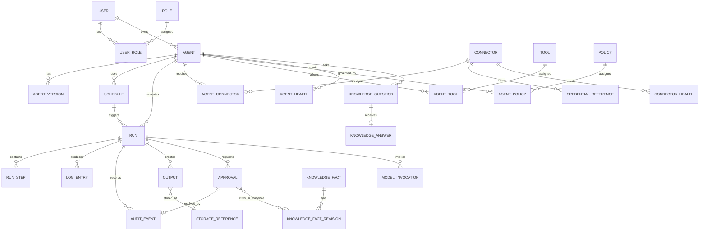
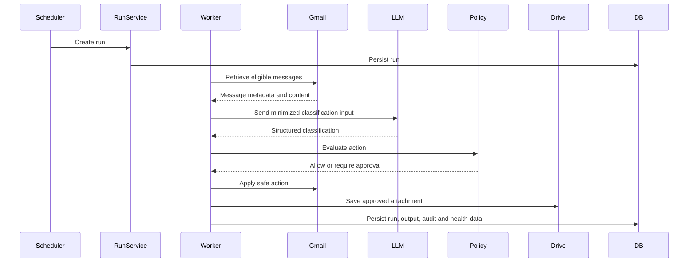

# Data Architecture

## 1. Purpose

This document defines the data architecture for the Agent Control Center.

It identifies:

- Core data domains
- Systems of record
- Logical entities
- Data ownership
- Data flows
- Data classification
- Retention expectations
- Data integrity controls
- Relationships between operational, audit, configuration, and output data

The objective is to establish a reliable and extensible information model before implementation begins.

---

## 2. Data Architecture Goals

The data architecture should:

- Establish clear systems of record
- Separate configuration from runtime data
- Preserve complete execution history
- Support auditability
- Minimize sensitive data retention
- Prevent duplicate agent actions
- Support reliable scheduling and retries
- Allow new agents and connectors to be added consistently
- Preserve compatibility with future multi-user and multi-agent expansion
- Support reporting and observability
- Support governed, versioned business facts used during drafting

---

## 3. Data Architecture Principles

### 3.1 PostgreSQL is the runtime system of record

PostgreSQL will be the authoritative source for:

- Agent definitions
- Schedules
- Runs
- Approvals
- Connector metadata
- Policies
- Health state
- Output metadata
- Audit records
- Knowledge facts, fact revisions, questions, and answers
- Operational configuration

### 3.2 External platforms remain authoritative for their own content

Examples:

- Gmail remains the system of record for email
- Google Drive remains the system of record for stored files
- Notion remains the operational project workspace
- Git remains the system of record for source code and architecture documentation

The Agent Control Center stores references and metadata unless full content retention is explicitly required.

### 3.3 Sensitive data is minimized

The platform should avoid storing:

- Full email bodies
- Full attachment contents in PostgreSQL
- Raw OAuth tokens in plaintext
- Unnecessary personal identifiers
- Full model prompts where summaries or hashes are sufficient

### 3.4 Audit records are append-oriented

Material actions should produce immutable or append-only audit records where practical.

### 3.5 Every runtime object has a stable identifier

Use stable identifiers for:

- Agents
- Agent versions
- Schedules
- Runs
- Steps
- Approvals
- Outputs
- Connectors
- Policies
- Audit events

### 3.6 Time is stored in UTC

All persisted timestamps should use UTC.

User-facing interfaces may display times in the user's configured time zone.

---

## 4. Data Domains

The platform contains the following primary data domains:

1. Identity and access
2. Agent catalog
3. Scheduling
4. Execution
5. Approvals
6. Connectors and credentials
7. Policies
8. Outputs and artifacts
9. Logging and audit
10. Health and observability
11. Notifications
12. Plugins and extensions
13. Draft-support knowledge

---

## 5. System-of-Record Matrix

| Data Domain                | System of Record                     |
| -------------------------- | ------------------------------------ |
| Source code                | GitHub                               |
| Architecture documentation | Git Markdown                         |
| Project management         | Notion                               |
| Agent definitions          | PostgreSQL                           |
| Agent runtime state        | PostgreSQL                           |
| Schedules                  | PostgreSQL                           |
| Run history                | PostgreSQL                           |
| Approvals                  | PostgreSQL                           |
| Audit events               | PostgreSQL                           |
| Operational logs           | Log platform or PostgreSQL initially |
| Email content              | Gmail                                |
| Stored files               | Google Drive initially               |
| OAuth credentials          | Encrypted credential store           |
| LLM usage records          | PostgreSQL                           |
| Draft-support knowledge    | PostgreSQL                           |
| Deployment secrets         | Hosting secret store                 |

---

## 6. Logical Data Model



---

## 7. Core Entities

## 7.1 User

Represents an authenticated platform user.

Key attributes:

- `user_id`
- `email`
- `display_name`
- `identity_provider`
- `identity_subject`
- `status`
- `timezone`
- `created_at`
- `updated_at`
- `last_login_at`

Initial deployment may contain only one user.

---

## 7.2 Role

Represents an authorization role.

Initial roles:

- Owner
- Administrator
- Operator
- Reviewer
- Read Only

Key attributes:

- `role_id`
- `name`
- `description`
- `created_at`

---

## 7.3 UserRole

Associates users with roles.

Key attributes:

- `user_id`
- `role_id`
- `assigned_at`
- `assigned_by`

---

## 7.4 Agent

Represents the current logical identity of an agent.

Key attributes:

- `agent_id`
- `owner_user_id`
- `name`
- `description`
- `agent_type`
- `status`
- `risk_level`
- `current_version_id`
- `entry_point`
- `configuration`
- `configuration_schema_version`
- `created_at`
- `updated_at`
- `disabled_at`

Example statuses:

```text
Draft
Active
Paused
Disabled
Degraded
Error
Retired
```

---

## 7.5 AgentVersion

Represents a versioned implementation of an agent.

Key attributes:

- `agent_version_id`
- `agent_id`
- `version`
- `implementation_type`
- `entry_point`
- `configuration_schema`
- `release_notes`
- `created_at`
- `activated_at`
- `retired_at`

This supports rollback and version-aware run history.

---

## 7.6 Schedule

Represents a recurring or one-time execution schedule.

Key attributes:

- `schedule_id`
- `agent_id`
- `schedule_type`
- `expression`
- `timezone`
- `status`
- `start_at`
- `end_at`
- `last_triggered_at`
- `next_run_at`
- `created_by`
- `created_at`
- `updated_at`

Schedule types:

- Manual
- OneTime
- Interval
- Cron
- EventDriven

---

## 7.7 Run

Represents one execution attempt of an agent.

Key attributes:

- `run_id`
- `agent_id`
- `agent_version_id`
- `schedule_id`
- `trigger_type`
- `triggered_by`
- `status`
- `started_at`
- `completed_at`
- `timeout_at`
- `correlation_id`
- `idempotency_key`
- `retry_count`
- `error_code`
- `error_summary`
- `cost_estimate`
- `input_summary`
- `result_summary`

Run statuses:

```text
Pending
Queued
Running
WaitingForApproval
Succeeded
PartiallySucceeded
Failed
Cancelled
TimedOut
```

---

## 7.8 RunStep

Represents a logical step within an agent run.

Key attributes:

- `run_step_id`
- `run_id`
- `step_name`
- `step_type`
- `sequence_number`
- `status`
- `started_at`
- `completed_at`
- `input_reference`
- `output_reference`
- `error_code`
- `retry_count`

Potential step types:

- ConnectorCall
- ModelCall
- PolicyEvaluation
- ToolExecution
- ApprovalWait
- OutputWrite
- Notification

---

## 7.9 Connector

Represents an external integration.

Key attributes:

- `connector_id`
- `owner_user_id`
- `connector_type`
- `display_name`
- `account_identifier`
- `status`
- `granted_scopes`
- `configuration`
- `last_success_at`
- `last_failure_at`
- `created_at`
- `updated_at`

Connector statuses:

```text
NotConfigured
Connecting
Connected
Degraded
Expired
Revoked
Error
```

---

## 7.10 CredentialReference

Represents a reference to encrypted connector credentials.

Key attributes:

- `credential_reference_id`
- `connector_id`
- `credential_type`
- `encrypted_value`
- `encryption_key_version`
- `created_at`
- `rotated_at`
- `expires_at`
- `revoked_at`

The application should avoid exposing this entity outside the credential service.

---

## 7.11 Tool

Represents an executable capability available to agents.

Key attributes:

- `tool_id`
- `name`
- `description`
- `connector_type`
- `input_schema`
- `output_schema`
- `required_permission`
- `risk_level`
- `requires_approval`
- `is_idempotent`
- `timeout_seconds`
- `status`

---

## 7.12 AgentTool

Associates approved tools with an agent.

Key attributes:

- `agent_id`
- `tool_id`
- `enabled`
- `configuration`
- `assigned_at`
- `assigned_by`

---

## 7.13 Policy

Represents a reusable execution or authorization policy.

Key attributes:

- `policy_id`
- `name`
- `description`
- `policy_type`
- `version`
- `definition`
- `status`
- `created_at`
- `updated_at`

Policy types may include:

- Authorization
- Approval
- Retention
- Cost
- Data access
- Tool use
- Retry
- Notification

---

## 7.14 AgentPolicy

Associates policies with an agent.

Key attributes:

- `agent_id`
- `policy_id`
- `priority`
- `enabled`
- `configuration`

---

## 7.15 Approval

Represents a human approval request.

Key attributes:

- `approval_id`
- `run_id`
- `run_step_id`
- `agent_id`
- `action_type`
- `risk_level`
- `status`
- `summary`
- `action_payload_reference`
- `requested_at`
- `expires_at`
- `reviewed_by`
- `reviewed_at`
- `decision_reason`
- `executed_at`
- `execution_result`

Approval statuses:

```text
Pending
Approved
Rejected
Expired
Cancelled
Executed
Failed
```

---

## 7.16 Output

Represents a structured result or artifact produced by an agent.

Key attributes:

- `output_id`
- `run_id`
- `agent_id`
- `output_type`
- `name`
- `description`
- `sensitivity`
- `storage_reference_id`
- `structured_value`
- `created_at`
- `retention_until`
- `deleted_at`

Output types may include:

- Classification
- DraftEmail
- Summary
- SavedAttachment
- Report
- Link
- StructuredData
- GeneratedDocument

---

## 7.17 StorageReference

Represents the physical or external location of a file or artifact.

Key attributes:

- `storage_reference_id`
- `provider`
- `external_id`
- `path`
- `content_type`
- `size_bytes`
- `checksum`
- `created_at`
- `last_verified_at`

Initial provider:

- Google Drive

Future providers:

- Object storage
- OneDrive
- Dropbox
- Local file bridge

---

## 7.18 LogEntry

Represents an operational log record.

Key attributes:

- `log_entry_id`
- `run_id`
- `run_step_id`
- `agent_id`
- `component`
- `severity`
- `event_type`
- `message`
- `structured_context`
- `correlation_id`
- `created_at`

Sensitive values must be redacted before persistence.

---

## 7.19 AuditEvent

Represents a material security or business action.

Key attributes:

- `audit_event_id`
- `actor_type`
- `actor_id`
- `action`
- `resource_type`
- `resource_reference`
- `run_id`
- `approval_id`
- `policy_id`
- `decision`
- `result`
- `correlation_id`
- `created_at`

Audit records should be append-only where practical.

---

## 7.20 ModelInvocation

Represents a call to an LLM provider.

Key attributes:

- `model_invocation_id`
- `run_id`
- `run_step_id`
- `provider`
- `model`
- `prompt_version`
- `input_token_count`
- `output_token_count`
- `latency_ms`
- `estimated_cost`
- `response_valid`
- `error_code`
- `created_at`

The platform should avoid storing full prompts and responses unless explicitly required.

---

## 7.21 AgentHealth

Represents summarized agent health.

Key attributes:

- `agent_health_id`
- `agent_id`
- `status`
- `last_success_at`
- `last_failure_at`
- `consecutive_failures`
- `success_rate_window`
- `average_duration_ms`
- `current_issue`
- `updated_at`

---

## 7.22 ConnectorHealth

Represents connector health.

Key attributes:

- `connector_health_id`
- `connector_id`
- `status`
- `last_checked_at`
- `last_success_at`
- `last_failure_at`
- `failure_count`
- `error_summary`

---

## 7.23 Notification

Represents a user-facing notification.

Key attributes:

- `notification_id`
- `user_id`
- `notification_type`
- `severity`
- `title`
- `message`
- `resource_type`
- `resource_id`
- `status`
- `created_at`
- `read_at`

---

## 7.24 Plugin

Represents an installable extension or connector package.

Key attributes:

- `plugin_id`
- `name`
- `version`
- `plugin_type`
- `publisher`
- `status`
- `manifest`
- `installed_at`
- `enabled_at`
- `disabled_at`

This entity may be deferred until the platform supports external plugins.

---

## 7.25 KnowledgeFact

Represents one active business fact available to drafting agents. It must not
contain secrets, credentials, protected health information, or content derived
from a message suppressed by the clinical or protected-health-information
policy.

Key logical attributes:

- `fact_id`
- `fact_key`
- `display_label`
- `current_revision_id`
- `status`
- `volatile`
- `last_confirmed_at`
- `created_at`
- `updated_at`
- `deleted_at`

Deleting a fact removes it from active retrieval. A referenced revision may be
retained under approval-evidence and audit retention rules so historical review
does not become misleading.

---

## 7.26 KnowledgeFactRevision

Represents an immutable version of a business fact.

Key logical attributes:

- `fact_revision_id`
- `fact_id`
- `revision_number`
- `value`
- `volatile`
- `last_confirmed_at`
- `source_type`
- `source_reference`
- `created_by_channel`
- `confirmed_by_human_owner_id`
- `confirmed_via_external_client_id` when confirmed through the external channel
- `created_at`
- `integrity_identity`

Approval evidence cites the exact revision used by a draft. The typed
`facts_used` evidence collection belongs to the existing approval evidence
payload and decision-context manifest. It is not a new top-level approval or
decision field.

---

## 7.27 KnowledgeQuestion

Represents an agent request for a missing business fact before drafting.

Key logical attributes:

- `knowledge_question_id`
- `agent_id`
- `run_id`
- `source_reference`
- `missing_fact_key`
- `question_text`
- `status`
- `correlation_id`
- `created_at`
- `answered_at`

A knowledge question is not an approval request, does not change approval
state, and does not use the approval Request clarification lifecycle.

---

## 7.28 KnowledgeAnswer

Represents the one human owner's answer to a knowledge question.

Key logical attributes:

- `knowledge_answer_id`
- `knowledge_question_id`
- `answer_value`
- `human_owner_id`
- `external_client_id` when submitted through the external channel
- `submission_channel`
- `validation_status`
- `resulting_fact_id`
- `resulting_fact_revision_id`
- `submitted_at`

Answer input is untrusted. Secrets, credentials, protected health information,
and content from a suppressed source must be rejected before knowledge-store
persistence. Audit evidence may record rejection metadata without retaining the
prohibited content.

---

## 8. Data Ownership

| Entity              | Owning Component             |
| ------------------- | ---------------------------- |
| User                | Authentication Service       |
| Role                | Authorization Service        |
| Agent               | Agent Registry Service       |
| AgentVersion        | Agent Registry Service       |
| Schedule            | Schedule Service             |
| Run                 | Run Management Service       |
| RunStep             | Agent Runtime                |
| Connector           | Connector Management Service |
| CredentialReference | Credential Service           |
| Tool                | Tool Registry                |
| Policy              | Policy Service               |
| Approval            | Approval Service             |
| Output              | Output Service               |
| StorageReference    | Output Service               |
| LogEntry            | Logging Service              |
| AuditEvent          | Audit Writer                 |
| ModelInvocation     | LLM Gateway                  |
| Health entities     | Health Service               |
| Notification        | Notification Service         |
| KnowledgeFact       | Knowledge capability         |
| KnowledgeFactRevision | Knowledge capability       |
| KnowledgeQuestion   | Knowledge capability         |
| KnowledgeAnswer     | Knowledge capability         |

Each owner is responsible for validation, lifecycle, and data integrity.

The knowledge capability is a logical control-plane responsibility. Accepted
ADR-005 does not require a separate deployment container.

---

## 9. Data Flow: Gmail Agent



### 9.1 R8 Draft-Support Knowledge Flow

Clinical and protected-health-information suppression is evaluated before a
message may supply knowledge context, create a question, or enter a
history-learning input. A suppressed message follows the existing manual-hold
path and contributes no fact, question content, answer context, or draft.

For an eligible message, the agent retrieves governed facts and their exact
revisions. If a required fact is absent or a volatile fact requires
re-confirmation, the agent creates a `KnowledgeQuestion` instead of a generic
draft. The one human owner's validated `KnowledgeAnswer` may create or update a
`KnowledgeFact` and immutable `KnowledgeFactRevision`. A later draft records the
exact revisions in the approval evidence `facts_used` collection.

History learning may consider only approved sends with a confirmed `Sent`
outcome. `Failed` and `Indeterminate` outcomes are not learning sources. Every
candidate fact retains source provenance and passes the same sensitivity,
clinical-suppression, and prohibited-content validation applied to direct
answers.

---

## 10. Data Classification

Initial classifications:

| Classification | Description                             | Examples                           |
| -------------- | --------------------------------------- | ---------------------------------- |
| Public         | Safe for public disclosure              | Published documentation            |
| Internal       | Operational project information         | Agent metadata, architecture notes |
| Confidential   | Personal or operational data            | Email metadata, outputs, logs      |
| Restricted     | Highly sensitive credentials or content | OAuth tokens, private email bodies |

---

## 11. Data Retention

Retention periods should be configurable.

Initial direction:

| Data Type                 | Initial Retention                   |
| ------------------------- | ----------------------------------- |
| Agent definitions         | Indefinite while active             |
| Agent versions            | Indefinite                          |
| Schedules                 | Indefinite with status history      |
| Run records               | 12 months initially                 |
| Run steps                 | 90 to 180 days                      |
| Operational logs          | 30 to 90 days                       |
| Audit events              | Longer-term, potentially indefinite |
| Approvals                 | 12 months or longer                 |
| Model invocation metadata | 90 days                             |
| Full prompts              | Avoid retaining by default          |
| Output metadata           | Based on output policy              |
| Saved files               | Based on Google Drive policy        |
| Failed queue jobs         | Limited retention                   |
| Notifications             | 90 days                             |
| Active knowledge facts    | Until deleted or superseded         |
| Referenced fact revisions | Approval evidence retention period  |
| Knowledge questions       | Defined by knowledge retention policy |
| Knowledge answers         | Minimum period required for provenance |

Final values require an ADR.

---

## 12. Data Integrity Controls

The platform should use:

- Primary keys
- Foreign keys
- Unique constraints
- Check constraints
- Version columns
- Optimistic concurrency
- Idempotency keys
- Transaction boundaries
- State-transition validation
- Checksums for files
- Referential integrity
- Soft deletion where history matters

Examples:

- Only one active agent version
- Unique schedule trigger key
- One execution per idempotency key
- Approval cannot be executed twice
- Run state cannot move backwards illegally
- Output must reference a valid run
- Approval `facts_used` entries must reference the exact fact revisions used
- A knowledge answer may resolve only its related pending question
- Deleted or stale facts cannot silently replace a fact revision bound to a draft

---

## 13. Idempotency Model

Idempotency is required for:

- Manual run requests
- Scheduled runs
- Queue delivery
- Gmail label application
- Gmail archiving
- Draft creation
- File saving
- Approval execution

Potential key structure:

```text
{agent_id}:{action_type}:{resource_reference}:{logical_time_window}
```

Example:

```text
gmail-triage:archive:message-hash:2026-07-10
```

The key must not expose sensitive external identifiers.

---

## 14. Concurrency Controls

Concurrency risks include:

- Duplicate scheduler execution
- Multiple workers processing the same job
- Simultaneous approval decisions
- Multiple agent versions being activated
- Concurrent connector refresh
- Duplicate file writes

Controls:

- Row locking
- Unique constraints
- Compare-and-swap updates
- Version columns
- Queue visibility timeouts
- Transactional updates
- Idempotency records

---

## 15. Sensitive Data Handling

Sensitive values should be:

- Encrypted where required
- Redacted in logs
- Excluded from queue messages
- Excluded from browser payloads
- Minimized in model prompts
- Restricted by role
- Retained only when required

Sensitive database fields may include:

- Encrypted refresh token
- Account identifier
- Sensitive output description
- Approval payload
- Restricted file reference
- Knowledge question or answer content

The knowledge store must reject secrets, credentials, protected health
information, and content derived from a clinically suppressed message. Fact
values exposed through the external API or approval evidence are minimum
necessary and follow their sensitivity and retention policies.

---

## 16. Search and Reporting

The dashboard will need query patterns for:

- Active agents
- Failed agents
- Due schedules
- Recent runs
- Pending approvals
- Recent outputs
- Connector errors
- Stale volatile facts requiring re-confirmation
- Pending knowledge questions
- Cost by agent
- Success rate
- Run duration
- Audit history

Indexes should support these operational queries.

Candidate indexes:

- `run(agent_id, created_at)`
- `run(status, created_at)`
- `schedule(status, next_run_at)`
- `approval(status, requested_at)`
- `log_entry(run_id, created_at)`
- `audit_event(resource_type, created_at)`
- `connector(status)`
- `agent(status)`

---

## 17. Data Migration Strategy

Use Alembic for PostgreSQL schema migrations.

Migration principles:

- Backward-compatible changes first
- Separate schema and data migrations where practical
- Backup before destructive changes
- Test migrations against realistic data volume
- Track migration version
- Avoid manual production schema edits
- Document rollback limitations

---

## 18. Backup and Recovery

Data recovery priorities:

1. Agent and schedule configuration
2. Run and approval state
3. Audit records
4. Connector metadata
5. Output metadata
6. Operational logs

Recovery controls:

- Automated PostgreSQL backups
- Restore testing
- Exportable configuration
- Git-based architecture and code recovery
- Notion workspace reproducibility
- Google Drive file history where available

---

## 19. Data Quality Monitoring

Monitor for:

- Orphaned records
- Invalid run states
- Missing agent versions
- Duplicate idempotency keys
- Outputs without storage references
- Expired approvals still marked pending
- Schedules with stale next-run times
- Connectors without health records
- Missing audit events for sensitive actions
- Approval evidence referencing a missing fact revision
- Knowledge facts missing provenance or confirmation state
- Knowledge records linked to a suppressed source

---

## 20. Data Privacy Considerations

The platform may process personal email and file content.

Controls should include:

- Explicit user consent
- Least-privilege access
- Data minimization
- Clear retention settings
- Deletion support
- Export capability
- Restricted access
- Auditability
- Provider data-use review
- Avoidance of unnecessary model exposure
- Exclusion of suppressed clinical or protected-health-information content from
  knowledge retrieval and learning pipelines

---

## 21. Future Multi-User Considerations

Future multi-user support may require:

- User ownership on all resources
- Row-level authorization
- Tenant identifiers
- Connector ownership
- Per-user encryption context
- Data export and deletion
- Role-based visibility
- Tenant-specific quotas
- Tenant-isolated audit views

The MVP should avoid design choices that make these additions impossible.

---

## 22. Data Architecture Risks

Key risks include:

- Retaining too much email content
- Mixing secrets with operational configuration
- Weak run-state integrity
- Duplicate processing
- Unbounded log growth
- Inconsistent external identifiers
- Missing audit events
- Excessive coupling to Gmail data structures
- Unencrypted credential values
- Poor migration discipline

---

## 23. Open Data Decisions

The following require ADRs:

- UUID versus alternative identifier strategy
- JSONB usage boundaries
- PostgreSQL-backed queue versus Redis
- Audit immutability approach
- Log storage location
- Prompt and response retention
- OAuth encryption implementation
- Soft-delete strategy
- Data retention defaults
- Search and reporting architecture
- Output metadata schema
- Multi-user ownership model

---

## 24. Current Status

- Core data domains defined
- Systems of record identified
- Logical entities defined
- Data ownership assigned
- Retention and classification direction established
- Detailed physical schema and migration scripts remain to be created
