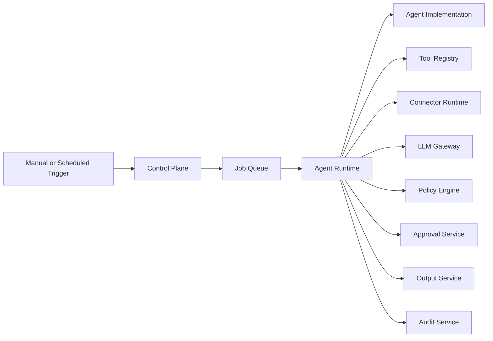
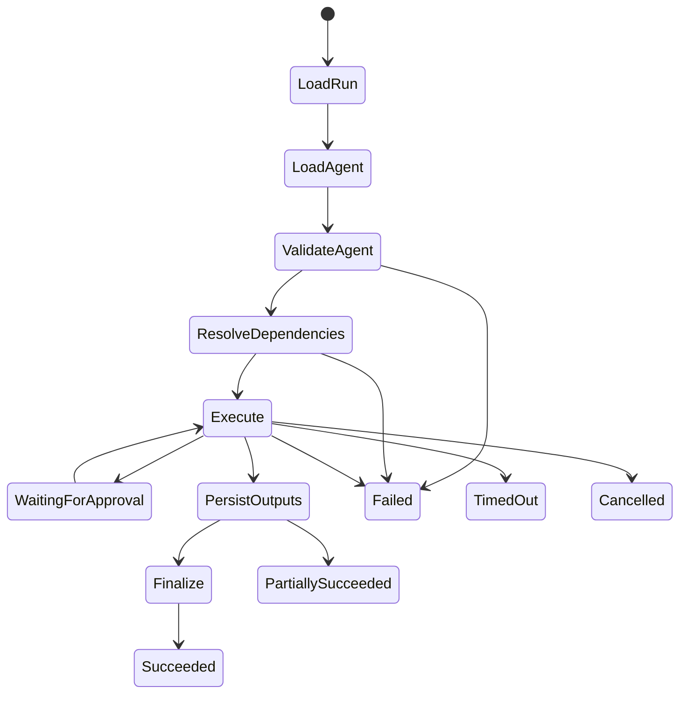
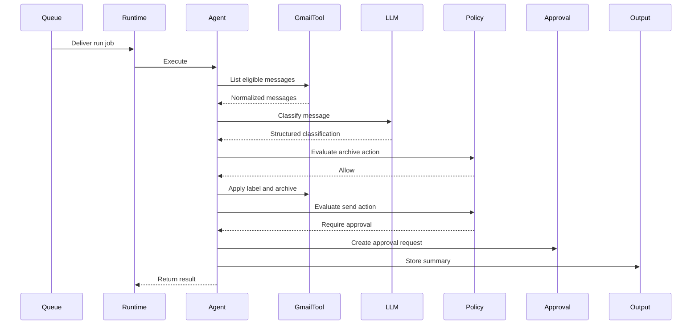

# Agent Runtime Architecture

> **Deferred Atlas-owned runtime architecture.** In the active MVP, agent
> runtimes are external and call Atlas through the contract in ADR-009 and
> `docs/specifications/agent-integration-api.md`.

## 1. Purpose

This document defines the runtime architecture used to execute agents within the Agent Control Center.

It describes:

- Agent contracts
- Runtime lifecycle
- Execution context
- Tool access
- Connector access
- LLM interaction
- State management
- Policy enforcement
- Approval handling
- Error handling
- Retries
- Cancellation
- Versioning
- Framework evolution

The objective is to create a runtime that is simple enough for the first Gmail agent while remaining extensible for future agents and orchestration frameworks.

---

## 2. Runtime Goals

The Agent Runtime should:

- Execute agents through a standard contract
- Separate agent logic from platform control logic
- Restrict each agent to approved tools and connectors
- Treat model output as untrusted
- Support deterministic and AI-assisted workflows
- Preserve run state and auditability
- Support retries without duplicate actions
- Support manual and scheduled execution
- Support human approval
- Allow future integration with LangGraph or Temporal
- Avoid coupling the platform to a single agent framework

---

## 3. Runtime Position in the Architecture

The Agent Runtime belongs to the execution plane.



The Runtime coordinates execution but does not own:

- Agent registration
- Schedule configuration
- User authentication
- Dashboard rendering
- Connector credential creation
- Long-term file storage

---

## 4. Agent Contract

Every executable agent must implement a standard contract.

Initial conceptual interface:

```python
from typing import Protocol

class Agent(Protocol):
    agent_id: str
    version: str

    def describe(self) -> "AgentDescriptor":
        ...

    async def validate(self, context: "AgentExecutionContext") -> None:
        ...

    async def run(
        self,
        context: "AgentExecutionContext",
    ) -> "AgentRunResult":
        ...

    async def health_check(self) -> "AgentHealthResult":
        ...
```

The exact implementation may evolve, but all agents must provide equivalent behavior.

---

## 5. Agent Descriptor

The descriptor declares the agent's capabilities and requirements.

Example:

```json
{
  "agent_id": "gmail-triage",
  "name": "Gmail Triage Agent",
  "version": "0.1.0",
  "description": "Classifies and processes eligible Gmail messages.",
  "runtime_type": "python",
  "required_connectors": ["gmail", "google-drive"],
  "allowed_tools": [
    "gmail.read_message",
    "gmail.apply_label",
    "gmail.archive_message",
    "gmail.create_draft",
    "drive.save_file"
  ],
  "risk_level": "medium",
  "supports_manual_run": true,
  "supports_scheduled_run": true,
  "supports_cancellation": true,
  "configuration_schema_version": "1"
}
```

The descriptor must not contain secrets.

---

## 6. Execution Context

The Runtime provides each agent with a controlled execution context.

Conceptual structure:

```python
@dataclass
class AgentExecutionContext:
    run_id: str
    agent_id: str
    agent_version: str
    trigger_type: str
    triggered_by: str | None
    correlation_id: str
    idempotency_key: str
    configuration: dict
    tools: "ToolAccess"
    connectors: "ConnectorAccess"
    llm: "LLMAccess"
    policy: "PolicyAccess"
    outputs: "OutputAccess"
    logger: "StructuredLogger"
    audit: "AuditAccess"
    cancellation: "CancellationToken"
    budget: "ExecutionBudget"
```

The context exposes controlled interfaces rather than raw service clients.

---

## 7. Runtime Lifecycle



Detailed lifecycle:

1. Receive job
2. Validate queue message
3. Load run record
4. Confirm valid run state
5. Load agent definition
6. Load agent implementation
7. Validate agent configuration
8. Resolve tools and connectors
9. Resolve policy set
10. Apply execution limits
11. Start the agent
12. Record steps
13. Validate proposed actions
14. Execute safe actions
15. Create approvals where required
16. Persist outputs
17. Write audit events
18. Update health
19. Finalize the run

---

## 8. Job Intake

The Runtime receives a queue message containing references.

Example:

```json
{
  "job_id": "job_123",
  "run_id": "run_456",
  "agent_id": "gmail-triage",
  "trigger_type": "scheduled",
  "correlation_id": "corr_789",
  "idempotency_key": "gmail-triage:2026-07-10T14:00:00Z"
}
```

The queue message must not contain:

- OAuth tokens
- Email bodies
- Attachments
- LLM API keys
- Database credentials
- Sensitive user content

---

## 9. Runtime Validation

Before execution, validate:

- Run exists
- Run state permits execution
- Agent exists
- Agent is active
- Requested version is available
- Configuration matches schema
- Required connectors are connected
- Required permissions are granted
- Required tools are enabled
- Execution budget is valid
- Idempotency key is not already completed
- Environment is permitted

Failure at this stage should stop execution before any external action occurs.

---

## 10. Tool Access

Agents should not call connectors directly.

They request operations through tools.

Example:

```python
await context.tools.execute(
    tool_id="gmail.apply_label",
    input={
        "message_reference": message_ref,
        "label": "Subscriptions",
    },
)
```

The Tool Runtime validates:

- Tool is registered
- Agent is permitted to use it
- Input matches schema
- Connector is available
- Action is allowed by policy
- Approval requirements are met
- Idempotency rules are satisfied

---

## 11. Tool Result Model

Every tool returns a normalized result.

```json
{
  "status": "succeeded",
  "tool_id": "gmail.apply_label",
  "operation_id": "operation_123",
  "output": {
    "label_applied": true
  },
  "external_reference": "hashed-message-reference",
  "started_at": "2026-07-10T14:05:00Z",
  "completed_at": "2026-07-10T14:05:01Z"
}
```

Possible statuses:

```text
Succeeded
Failed
Denied
WaitingForApproval
TimedOut
Skipped
AlreadyCompleted
```

---

## 12. Connector Access

Connector access is mediated through the Connector Runtime.

The agent must not receive:

- Raw OAuth refresh tokens
- Raw API keys
- General-purpose unrestricted clients
- Unscoped external service access

Example connector operation:

```python
messages = await context.connectors.gmail.list_messages(
    query="in:inbox newer_than:1d",
    max_results=100,
)
```

The Connector Runtime handles:

- Token retrieval
- Token refresh
- Scope validation
- Rate limits
- Timeouts
- Error normalization
- Telemetry
- Redaction

---

## 13. LLM Access

Agents use the LLM Gateway rather than a provider SDK directly.

Example:

```python
classification = await context.llm.invoke_structured(
    prompt_id="gmail-classification-v1",
    input={
        "sender": sender,
        "subject": subject,
        "body_excerpt": body_excerpt,
    },
    response_schema=EmailClassification,
)
```

The LLM Gateway controls:

- Provider
- Model
- Prompt version
- Structured output
- Data minimization
- Token limits
- Cost limits
- Retries
- Timeouts
- Response validation
- Trace metadata

---

## 14. Deterministic and Agentic Execution

The Runtime should support two execution patterns.

### 14.1 Deterministic workflow

Use when steps are known.

Example:

```text
Read email
  |
  v
Classify
  |
  v
Apply label
  |
  v
Archive if policy allows
```

This should be implemented with plain Python first.

### 14.2 Agentic workflow

Use when the model must select among tools or determine a path.

Example:

```text
Read request
  |
  v
Choose Calendar tool
  |
  v
Check availability
  |
  v
Choose Gmail tool
  |
  v
Draft response
```

Agentic execution should still operate inside strict tool and policy boundaries.

---

## 15. Action Proposal Model

Agents may produce action proposals rather than execute actions directly.

Example:

```json
{
  "action_type": "gmail.archive_message",
  "tool_id": "gmail.archive_message",
  "target_reference": "hashed-message-reference",
  "reason": "Message classified as subscription",
  "confidence": 0.97,
  "risk_level": "low",
  "parameters": {
    "message_reference": "internal-message-ref"
  }
}
```

The Runtime validates the proposal before execution.

---

## 16. Policy Evaluation

Every proposed external action passes through policy evaluation.

Inputs:

- Agent
- Tool
- User
- Connector
- Action
- Risk level
- Confidence
- Data sensitivity
- Environment
- Prior approvals

Possible outcomes:

```text
Allow
Deny
RequireApproval
AllowWithConditions
Escalate
```

The LLM cannot override the policy result.

---

## 17. Approval Handling

When approval is required:

1. Runtime creates an Approval record
2. Run state becomes `WaitingForApproval`
3. Worker stops or suspends safely
4. User reviews the request
5. Approval Service records the decision
6. Runtime resumes or starts a continuation
7. Action is revalidated
8. Action is executed once
9. Audit event is written

The approval must bind to:

- Exact action
- Exact target
- Exact content or payload hash
- Agent
- Run
- Expiry time
- Reviewer

---

## 18. State Management

The MVP Runtime should keep persistent execution state in PostgreSQL.

Persistent state includes:

- Run status
- Step status
- Approval status
- Tool operation result
- Retry count
- Output references
- Error information
- Checkpoints where needed

The worker process should remain stateless wherever practical.

---

## 19. Checkpointing

Checkpointing becomes important for longer workflows.

A checkpoint should record:

- Current step
- Completed steps
- Pending action
- Input references
- Output references
- Approval reference
- Retry state
- Agent version
- Configuration version

Initial Gmail classification may not require full checkpointing.

LangGraph or Temporal may later provide more advanced persistence.

---

## 20. Execution Budgets

Each run should have limits.

Example:

```json
{
  "max_duration_seconds": 300,
  "max_tool_calls": 200,
  "max_model_calls": 100,
  "max_input_tokens": 200000,
  "max_output_tokens": 20000,
  "max_estimated_cost_usd": 2.0,
  "max_retries": 3
}
```

Budget breaches should stop or safely degrade the run.

---

## 21. Timeout Strategy

Timeouts should exist at multiple levels:

- Run timeout
- Step timeout
- Tool timeout
- Connector timeout
- LLM timeout
- Approval expiry

Timeouts should produce explicit states rather than generic failures.

---

## 22. Retry Strategy

Retries should distinguish between transient and permanent failures.

### Retryable

- Rate limits
- Temporary network failures
- Provider timeout
- Service unavailable
- Queue delivery interruption

### Non-retryable

- Invalid configuration
- Authorization denied
- Unsupported tool
- Malformed action after repeated validation
- Revoked connector
- Policy denial

Retry policy should define:

- Maximum attempts
- Backoff
- Jitter
- Retryable error categories
- Final failure state

---

## 23. Idempotency

Every side-effecting operation must be idempotent or protected by an idempotency record.

Examples:

- Applying a Gmail label
- Archiving a Gmail message
- Creating a draft
- Saving an attachment
- Sending an approved email
- Writing an output

The Runtime should check whether an operation has already succeeded before repeating it.

---

## 24. Cancellation

The Runtime should support cooperative cancellation.

Cancellation may be requested when:

- User cancels a run
- Agent is disabled
- Platform enters maintenance
- Execution budget is exceeded
- Security issue is detected

The agent should check the cancellation token:

- Between major steps
- Before external side effects
- Before long model calls
- Before storing large files

Cancellation does not reverse completed external actions.

---

## 25. Error Model

Normalize failures into platform categories.

```json
{
  "error_code": "CONNECTOR_RATE_LIMIT",
  "category": "connector",
  "retryable": true,
  "summary": "Gmail rate limit reached",
  "component": "gmail-connector",
  "external_status": 429,
  "correlation_id": "corr_789"
}
```

Categories:

- Validation
- Authentication
- Authorization
- Configuration
- Connector
- RateLimit
- Model
- Policy
- Approval
- Queue
- Database
- Timeout
- Cancellation
- Internal

---

## 26. Partial Success

A run may complete with some actions successful and others failed.

Example:

- 95 emails classified
- 92 labels applied
- 3 attachment saves failed

The Runtime should record:

- Overall status: `PartiallySucceeded`
- Per-step status
- Successful actions
- Failed actions
- Retry eligibility
- User-visible summary

---

## 27. Logging

The Runtime should generate structured events for:

- Run received
- Validation completed
- Agent loaded
- Connector resolved
- Tool invoked
- Model invoked
- Policy decision
- Approval created
- Action executed
- Output stored
- Retry scheduled
- Run completed
- Run failed

Logs should include:

- Run ID
- Agent ID
- Correlation ID
- Step ID
- Component
- Event type
- Severity
- Timestamp

---

## 28. Audit Events

Audit events are required for material actions.

Examples:

- Agent started
- Agent disabled
- Connector accessed
- Approval requested
- Approval granted
- Message archived
- Draft created
- File saved
- Email sent
- Policy denied action

Audit records must not include raw secrets.

---

## 29. Output Handling

Agents should return a structured run result.

```python
@dataclass
class AgentRunResult:
    status: str
    summary: str
    outputs: list["AgentOutput"]
    metrics: dict
    warnings: list[str]
    next_actions: list[str]
```

Outputs may include:

- Classification result
- Draft
- File reference
- Summary
- Report
- Link
- Structured data

---

## 30. Health Reporting

After each run, the Runtime updates agent health.

Inputs may include:

- Run outcome
- Duration
- Failure category
- Consecutive failures
- Connector state
- Policy denials
- Retry count

Example health logic:

```text
Recent success and no connector issue -> Healthy
Repeated transient failures -> Degraded
Repeated crashes or invalid configuration -> Unhealthy
Agent disabled -> Disabled
```

---

## 31. Agent Versioning

Every run must record the exact agent version used.

Versioning supports:

- Rollback
- Reproducibility
- Comparison
- Incident investigation
- Controlled rollout

The Runtime should not load an unspecified mutable version in production.

---

## 32. Configuration Versioning

Agent configuration should be versioned or snapshot at run time.

A run should be reproducible with:

- Agent version
- Configuration version
- Prompt version
- Policy version
- Tool version
- Connector version where relevant

---

## 33. Framework Strategy

## 33.1 Plain Python

Use for:

- Fixed workflows
- Deterministic execution
- Initial Gmail agent
- Simple classification and action sequences

Benefits:

- Easy to understand
- Easy to test
- Minimal dependencies
- Clear control flow

## 33.2 LangChain

Introduce when:

- Reusable tool abstractions become valuable
- Prompt and model orchestration becomes repetitive
- Multiple model providers need a common interface
- Retrieval pipelines become common

LangChain should remain an implementation detail behind platform contracts.

## 33.3 LangGraph

Introduce when:

- Workflows branch
- Persistent state is required
- Human approval pauses execution
- Runs resume later
- The workflow loops
- Agent state must be checkpointed

LangGraph should plug into the Agent Runtime through an adapter.

## 33.4 Temporal

Introduce when:

- Workflow durability is business-critical
- Runs span hours or days
- Cross-service orchestration becomes complex
- Strong retry and timeout guarantees are needed
- Infrastructure failures must not lose workflow progress

Temporal may eventually own durable workflow state, while PostgreSQL remains the platform system of record.

---

## 34. Runtime Adapter Pattern

The platform should support multiple runtime implementations through adapters.

Conceptual interface:

```python
class RuntimeAdapter(Protocol):
    async def execute(
        self,
        agent_definition: AgentDefinition,
        context: AgentExecutionContext,
    ) -> AgentRunResult:
        ...
```

Potential adapters:

- `PlainPythonRuntimeAdapter`
- `LangGraphRuntimeAdapter`
- `TemporalRuntimeAdapter`
- `ExternalServiceRuntimeAdapter`

This protects the platform from framework lock-in.

---

## 35. Gmail Agent Runtime Example



---

## 36. Testing Strategy

### Unit tests

- Agent validation
- Action proposal validation
- Policy integration
- Budget enforcement
- Retry classification
- Error normalization
- State transitions

### Contract tests

- Agent contract
- Tool contract
- Connector contract
- Runtime adapter contract
- Structured model response

### Integration tests

- Queue to Runtime
- Runtime to PostgreSQL
- Runtime to Gmail sandbox
- Approval pause and resume
- Output persistence
- Idempotent replay

### Failure tests

- Worker crash
- Duplicate queue delivery
- Expired token
- Model timeout
- Invalid model output
- Approval expiry
- Partial external success

---

## 37. Runtime Security Controls

The Runtime must:

- Load only registered agents
- Permit only assigned tools
- Validate configuration
- Restrict connectors
- Enforce execution budgets
- Validate all model output
- Apply policy before action
- Require approval where configured
- Protect credentials
- Redact logs
- Record audit events
- Prevent duplicate actions
- Support emergency cancellation

---

## 38. Operational Metrics

Track:

- Runs started
- Runs completed
- Success rate
- Failure rate
- Partial success rate
- Average duration
- Queue wait time
- Tool-call count
- Model-call count
- Token usage
- Cost
- Retry count
- Approval wait time
- Cancellation count
- Timeout count

---

## 39. Open Decisions

The following require ADRs:

- Agent interface implementation
- Sync versus async agent methods
- Runtime dependency injection
- Queue library
- Checkpoint persistence model
- Approval continuation model
- Runtime adapter boundary
- LangGraph adoption criteria
- Temporal adoption criteria
- Execution budget defaults
- Cancellation behavior
- Partial-success rules
- Agent package loading strategy

---

## 40. Current Status

- Runtime responsibilities defined
- Standard agent contract proposed
- Execution context defined
- Tool and connector boundaries defined
- LLM and policy controls defined
- Retry, timeout, cancellation, and idempotency models outlined
- Framework migration strategy defined
- Physical implementation remains to be designed and built
