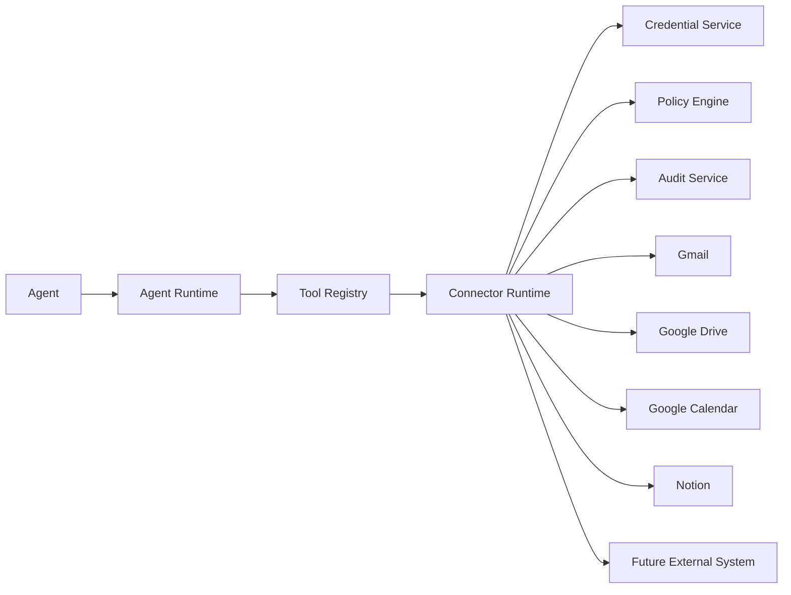
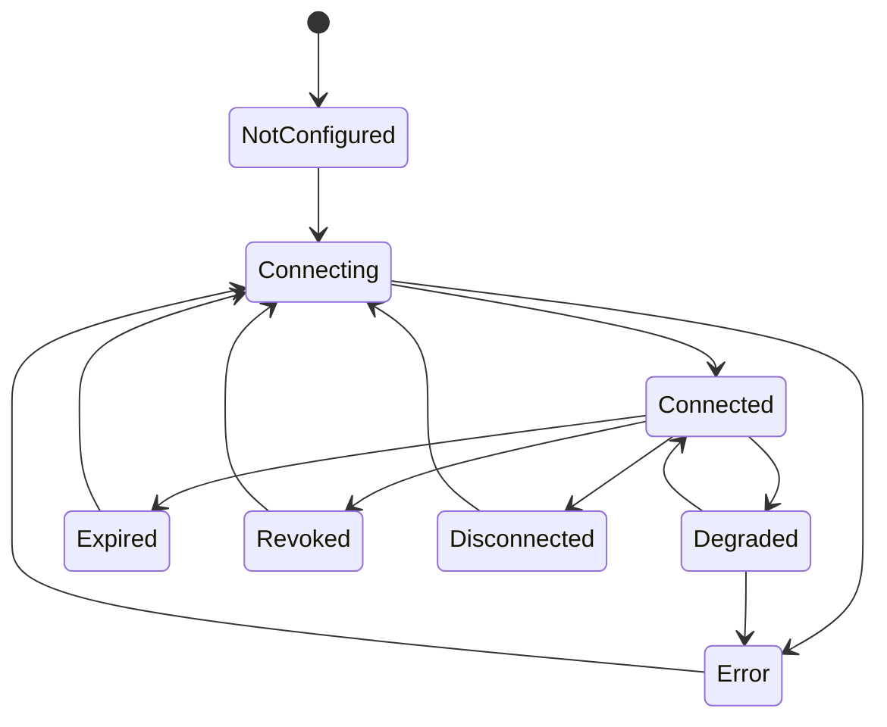
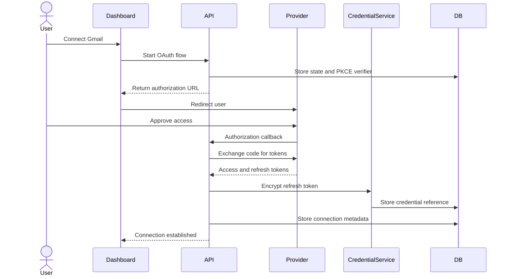
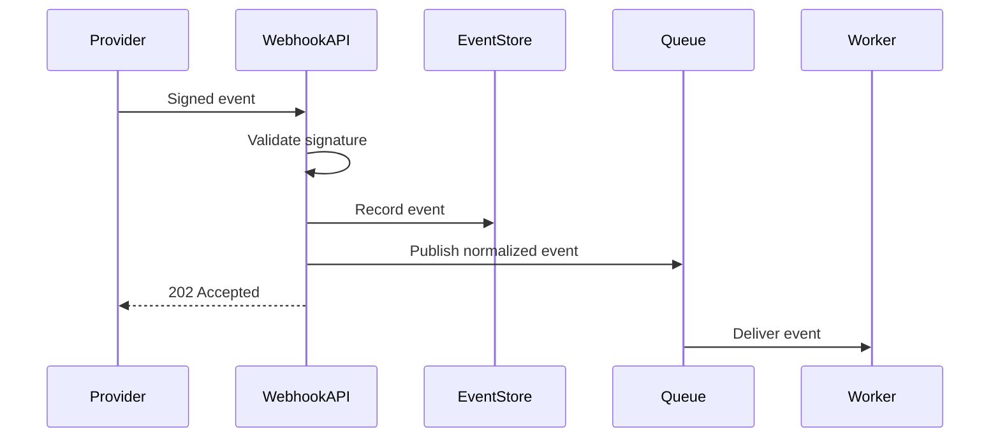

# Connector Framework

## 1. Purpose

This document defines the connector framework for the Agent Control Center.

Connectors provide controlled access to external systems such as:

- Gmail
- Google Drive
- Google Calendar
- Notion
- Microsoft Outlook
- Microsoft OneDrive
- Slack
- Dropbox
- Local file bridges
- Future enterprise applications

The connector framework isolates external-service complexity from agents and provides a consistent model for authentication, authorization, error handling, observability, and security.

---

## 2. Connector Framework Goals

The framework should:

- Provide a standard interface for external systems
- Prevent agents from using unrestricted service clients
- Enforce least-privilege permissions
- Support OAuth and API-key based integrations
- Normalize external errors and rate limits
- Expose connector health
- Record audit and telemetry data
- Support versioning
- Support revocation and reconnection
- Allow new connectors without changing the core platform
- Protect the platform from vendor-specific implementation details

---

## 3. Architectural Position

Connectors sit between the Agent Runtime and external systems.



Agents request approved tools. Tools invoke connector operations. Agents should not receive raw connector clients or credentials.

---

## 4. Connector Types

The platform should support several connector categories.

### 4.1 OAuth connectors

Examples:

- Gmail
- Google Drive
- Google Calendar
- Microsoft Outlook
- Microsoft OneDrive

Characteristics:

- User authorization required
- Access and refresh tokens
- Scope-based permissions
- Token refresh
- Revocation
- Redirect URI handling

### 4.2 Static API-key connectors

Examples:

- LLM providers
- SaaS APIs
- Internal services

Characteristics:

- API key or token
- No interactive user authorization
- Environment or vault-based secret storage
- Rotation support

### 4.3 Internal platform connectors

Examples:

- PostgreSQL
- Queue
- Object storage
- Notification service

Characteristics:

- Service identity
- Infrastructure credentials
- Private connectivity
- No user-facing authorization flow

### 4.4 Local bridge connectors

Examples:

- Local file system bridge
- Desktop sync service
- Local automation daemon

Characteristics:

- Runs outside the hosted boundary
- Requires explicit trust
- Uses a narrow local API or synchronized folder
- Must not expose arbitrary filesystem access

### 4.5 Webhook connectors

Examples:

- GitHub webhook
- Email event webhook
- Calendar event notification

Characteristics:

- Inbound signed requests
- Replay protection
- Secret verification
- Idempotent event processing

---

## 5. Connector Contract

Every connector must implement a standard contract.

Conceptual interface:

```python
from typing import Protocol

class Connector(Protocol):
    connector_type: str
    version: str

    def describe(self) -> "ConnectorDescriptor":
        ...

    async def connect(self, context: "ConnectionContext") -> "ConnectionResult":
        ...

    async def disconnect(self, connection_id: str) -> None:
        ...

    async def health_check(
        self,
        connection_id: str,
    ) -> "ConnectorHealthResult":
        ...

    async def execute(
        self,
        operation: str,
        input_data: dict,
        context: "ConnectorExecutionContext",
    ) -> "ConnectorOperationResult":
        ...
```

The precise implementation may change, but equivalent capabilities are required.

---

## 6. Connector Descriptor

Each connector declares its capabilities and requirements.

Example:

```json
{
  "connector_type": "gmail",
  "name": "Gmail",
  "version": "1.0.0",
  "authentication_type": "oauth2",
  "supported_operations": [
    "list_messages",
    "get_message",
    "apply_label",
    "archive_message",
    "create_draft",
    "get_attachment"
  ],
  "required_scopes": {
    "list_messages": ["gmail.readonly"],
    "apply_label": ["gmail.modify"],
    "archive_message": ["gmail.modify"],
    "create_draft": ["gmail.compose"]
  },
  "supports_health_check": true,
  "supports_revocation": true,
  "supports_refresh": true
}
```

The descriptor must not contain secret values.

---

## 7. Connector Registration

A connector must be registered before it can be used.

Registration records should include:

- Connector type
- Connector version
- Display name
- Authentication type
- Supported operations
- Required scopes
- Risk level by operation
- Health-check support
- Rate-limit model
- Configuration schema
- Error taxonomy
- Provider documentation reference

New connectors should become visible in the dashboard after registration.

---

## 8. Connection Instance

A connector definition describes a connector type.

A connection instance represents one configured account or service connection.

Example:

```json
{
  "connection_id": "conn_123",
  "connector_type": "gmail",
  "display_name": "Prashant Gmail",
  "account_identifier": "prashant.vasudeva@gmail.com",
  "status": "connected",
  "granted_scopes": ["gmail.readonly", "gmail.modify"],
  "created_at": "2026-07-10T14:00:00Z",
  "last_success_at": "2026-07-10T15:00:00Z"
}
```

A connector type may support multiple connection instances in the future.

---

## 9. Connector Lifecycle



Lifecycle states:

- NotConfigured
- Connecting
- Connected
- Degraded
- Expired
- Revoked
- Error
- Disconnected

---

## 10. OAuth Flow

The OAuth flow should use Authorization Code with PKCE where appropriate.



---

## 11. OAuth Security

OAuth controls should include:

- State parameter
- PKCE
- Exact redirect URI validation
- Least-privilege scopes
- Token encryption
- No token exposure to browser JavaScript
- Refresh-token rotation where supported
- Revocation support
- Connection-expiry handling
- Scope-change detection
- Audit logging

The platform should display granted scopes to the user.

---

## 12. Credential Service

The Credential Service manages secret values.

Responsibilities:

- Encrypt credentials
- Decrypt only when needed
- Rotate credentials
- Revoke credentials
- Return short-lived access material
- Track key version
- Prevent secret logging
- Enforce connector ownership

Credential values should not be stored in general connector configuration.

---

## 13. Connector Execution Context

Every connector call should receive a controlled context.

Conceptual structure:

```python
@dataclass
class ConnectorExecutionContext:
    run_id: str
    agent_id: str
    user_id: str
    connection_id: str
    correlation_id: str
    operation_id: str
    idempotency_key: str
    timeout_seconds: int
    approved_permissions: set[str]
    audit: "AuditAccess"
    logger: "StructuredLogger"
    cancellation: "CancellationToken"
```

---

## 14. Connector Operation Model

Connector calls should use named operations rather than arbitrary client methods.

Example:

```python
result = await connector.execute(
    operation="apply_label",
    input_data={
        "message_reference": "internal-message-ref",
        "label": "Subscriptions",
    },
    context=context,
)
```

Benefits:

- Explicit operation allowlist
- Schema validation
- Risk classification
- Consistent audit logging
- Easier testing
- Better framework independence

---

## 15. Connector Operation Descriptor

Each operation should declare:

- Operation ID
- Description
- Input schema
- Output schema
- Required scopes
- Risk level
- Whether approval is required
- Whether it is idempotent
- Timeout
- Retry policy
- Audit requirements

Example:

```json
{
  "operation_id": "gmail.archive_message",
  "required_scopes": ["gmail.modify"],
  "risk_level": "low",
  "requires_approval": false,
  "idempotent": true,
  "timeout_seconds": 30
}
```

---

## 16. Connector Result Model

Every connector operation should return a normalized result.

```json
{
  "status": "succeeded",
  "operation_id": "gmail.archive_message",
  "external_reference": "hashed-resource-reference",
  "result": {
    "archived": true
  },
  "started_at": "2026-07-10T14:30:00Z",
  "completed_at": "2026-07-10T14:30:01Z",
  "provider_request_id": "provider-request-id"
}
```

Supported statuses:

- Succeeded
- Failed
- Denied
- TimedOut
- RateLimited
- AlreadyCompleted
- PartiallySucceeded

---

## 17. Error Normalization

External errors must be translated into a common platform model.

Example:

```json
{
  "error_code": "CONNECTOR_RATE_LIMIT",
  "connector_type": "gmail",
  "operation": "list_messages",
  "retryable": true,
  "provider_status": 429,
  "summary": "Gmail API rate limit reached",
  "correlation_id": "corr_123"
}
```

Common categories:

- Authentication
- Authorization
- ExpiredCredential
- RevokedCredential
- RateLimit
- Timeout
- Validation
- ResourceNotFound
- Conflict
- ProviderUnavailable
- ProviderError
- UnsupportedOperation
- Internal

---

## 18. Rate-Limit Handling

Connectors should:

- Detect provider rate-limit responses
- Read retry headers where available
- Apply backoff and jitter
- Respect provider quotas
- Avoid retry storms
- Track retry count
- Surface degraded health
- Stop after configured limits

Rate-limit policies may vary by connector and operation.

---

## 19. Retry Strategy

Retries should be connector-specific.

Retryable examples:

- Temporary network failure
- Provider unavailable
- Rate limit
- Gateway timeout

Non-retryable examples:

- Revoked token
- Missing scope
- Invalid request
- Resource not found where expected
- Policy denial

Retries must not cause duplicate external side effects.

---

## 20. Idempotency

Every side-effecting connector operation must support idempotency where practical.

Examples:

- Apply label
- Archive message
- Create draft
- Save file
- Create calendar event
- Send email

Idempotency controls may include:

- Internal operation record
- Provider idempotency key
- Pre-execution lookup
- External-resource marker
- Content checksum
- Unique constraint

---

## 21. Connector Health

Each connection should expose health.

Health dimensions:

- Credential validity
- Scope validity
- Provider availability
- Recent success
- Recent failure
- Rate-limit condition
- Configuration validity

Health states:

- Healthy
- Degraded
- Unhealthy
- Expired
- Revoked
- Unknown

Example:

```json
{
  "status": "degraded",
  "last_checked_at": "2026-07-10T15:00:00Z",
  "last_success_at": "2026-07-10T14:50:00Z",
  "last_failure_at": "2026-07-10T14:58:00Z",
  "issue": "Temporary rate limiting"
}
```

---

## 22. Connector Observability

Track:

- Operation count
- Success rate
- Failure rate
- Latency
- Retry count
- Rate-limit events
- Token-refresh failures
- Scope errors
- Provider availability
- Cost where applicable

Telemetry should avoid raw sensitive content.

---

## 23. Connector Audit Requirements

Material connector events include:

- Connection created
- Connection revoked
- Scope changed
- Credential refreshed
- Credential failed
- External action executed
- External action denied
- External resource created
- External resource modified
- External file saved

Audit records should include:

- User
- Agent
- Connector
- Operation
- Resource reference
- Result
- Correlation ID
- Timestamp
- Approval reference where applicable

---

## 24. Connector Configuration

Connector configuration should be schema-driven.

Example:

```json
{
  "connector_type": "gmail",
  "configuration": {
    "default_query": "in:inbox newer_than:1d",
    "max_messages_per_run": 100,
    "allowed_labels": ["Family", "Friends", "Work", "Shopping", "Subscriptions"]
  }
}
```

Configuration must not contain secret values.

---

## 25. Gmail Connector

Initial operations:

- List messages
- Get message
- Get thread
- Apply label
- Remove label
- Archive message
- Create draft
- Retrieve attachment
- Send message later
- Delete message later

Initial restrictions:

- No automatic send
- No automatic delete
- No unrestricted mailbox scan
- No access beyond approved scopes
- No storage of full mailbox content

---

## 26. Google Drive Connector

Initial operations:

- Create folder
- Find folder
- Save file
- Check file existence
- Retrieve file metadata
- Return share-safe link where allowed

Restrictions:

- Approved folder hierarchy only
- No external sharing initially
- No arbitrary deletion
- No unrestricted Drive access where narrower access is possible

---

## 27. Notion Connector

Initial operations:

- Create page
- Update page content
- Create database
- Create records
- Create relations
- Retrieve existing object IDs
- Maintain synchronization manifest

Restrictions:

- Access limited to the configured parent page
- No destructive deletion by default
- No workspace-wide access
- No token logging

---

## 28. Local File Bridge

The hosted platform should not directly access arbitrary local paths.

Preferred initial approach:

```text
Agent Control Center
    |
    v
Google Drive Folder
    |
    v
Google Drive Desktop
    |
    v
Approved Local Folder
```

Future local bridge requirements:

- Explicit folder allowlist
- Mutual authentication
- Narrow API
- No arbitrary command execution
- Local audit log
- User-controlled enable and disable
- Secure update mechanism

---

## 29. Webhook Connector Architecture

Inbound webhooks should:

- Validate signature
- Validate timestamp
- Reject replayed events
- Enforce payload size limits
- Normalize event schema
- Persist event receipt
- Process idempotently
- Return quickly
- Queue downstream work

Example flow:



---

## 30. Connector Versioning

Every connector should have a version.

Versioning supports:

- Provider API changes
- Scope changes
- Schema evolution
- Rollback
- Compatibility testing
- Connector-specific migrations

A run should record the connector version used where operationally relevant.

---

## 31. Connector Compatibility

The platform should validate compatibility between:

- Agent version
- Tool version
- Connector version
- Configuration schema
- External API version

Incompatible combinations should fail before execution.

---

## 32. Connector Testing

### Unit tests

- Input validation
- Output normalization
- Error mapping
- Scope validation
- Retry classification
- Redaction

### Contract tests

- Connector interface
- Operation descriptors
- Result schemas
- Health response
- Error schema

### Integration tests

- OAuth callback
- Token refresh
- Provider sandbox
- Revocation
- Rate-limit handling
- Attachment retrieval
- File save

### Failure tests

- Expired token
- Missing scope
- Invalid resource
- Provider outage
- Duplicate operation
- Timeout
- Partial success

---

## 33. Connector Security Controls

The connector framework must:

- Use least privilege
- Protect credentials
- Restrict operations
- Validate inputs
- Validate outputs
- Enforce policy
- Apply approval rules
- Normalize errors
- Redact logs
- Support revocation
- Record audit events
- Prevent duplicate side effects

---

## 34. Plugin Relationship

Connectors may eventually be packaged as plugins.

A connector plugin manifest may declare:

- Plugin ID
- Connector type
- Version
- Publisher
- Required permissions
- Supported operations
- Configuration schema
- Runtime requirements
- Security classification
- Signature information

External plugins should not be supported until a strong trust and signing model exists.

---

## 35. Open Decisions

The following require ADRs:

- Connector SDK structure
- OAuth library
- Credential encryption implementation
- Connector plugin packaging
- Connector version compatibility model
- Provider request logging policy
- Local file bridge design
- Webhook framework
- Scope-upgrade flow
- Multiple account support
- Connector sandbox strategy
- Shared versus connector-specific retry logic

---

## 36. Current Status

- Connector categories defined
- Standard connector contract proposed
- OAuth lifecycle defined
- Credential and security boundaries defined
- Operation and result models defined
- Initial Gmail, Drive, and Notion connector responsibilities documented
- Physical connector SDK implementation remains to be designed and built
