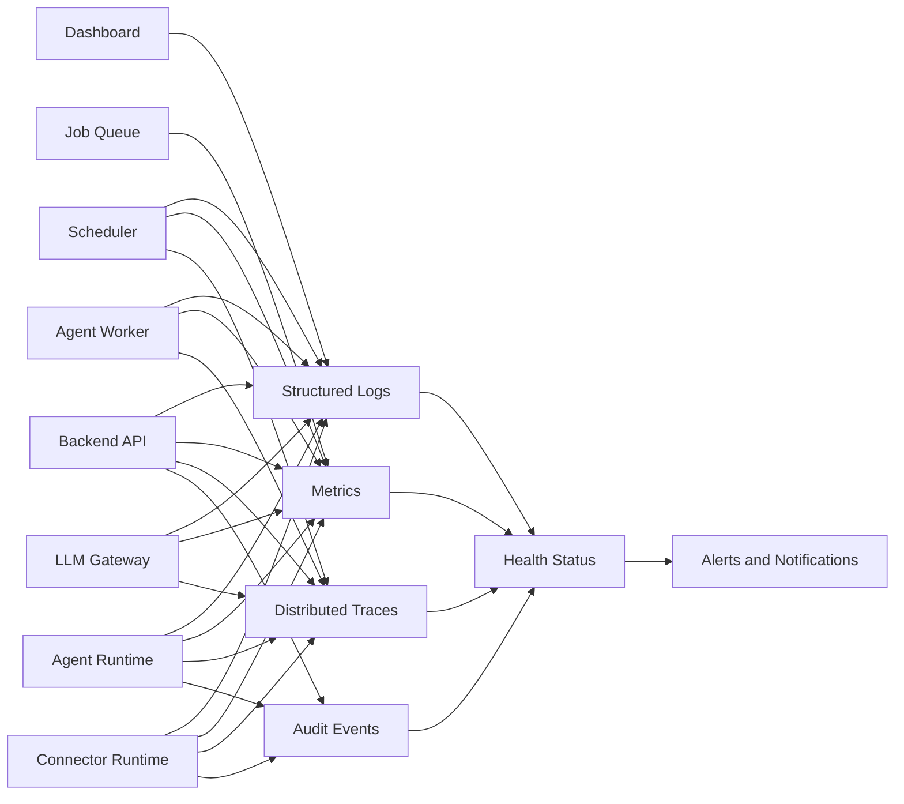
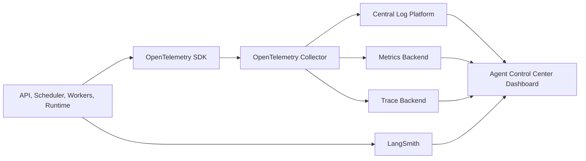

# Observability Architecture

## 1. Purpose

This document defines the observability architecture for the Agent Control Center.

It describes how the platform will collect, correlate, store, analyze, and present:

- Logs
- Metrics
- Traces
- Audit events
- Agent health
- Connector health
- Model usage
- Cost
- Failures
- Operational alerts

The objective is to make agent behaviour understandable, diagnosable, measurable, and auditable.

---

## 2. Observability Goals

The observability architecture should:

- Show whether the platform is healthy
- Show whether each agent is healthy
- Explain why a run succeeded or failed
- Correlate activity across services
- Track external connector reliability
- Track model latency, usage, and cost
- Distinguish operational logs from audit records
- Support troubleshooting without exposing sensitive content
- Detect repeated or abnormal failures
- Provide dashboard-ready status information
- Preserve a migration path to OpenTelemetry and centralized monitoring

---

## 3. Observability Principles

### 3.1 Observable by default

Every meaningful operation should emit structured telemetry.

### 3.2 Correlation across components

A single run should be traceable across:

- Dashboard
- API
- Scheduler
- Queue
- Worker
- Agent Runtime
- Connector
- LLM provider
- Database
- Output storage

### 3.3 No secrets in telemetry

Logs, metrics, and traces must not contain:

- OAuth tokens
- API keys
- Session cookies
- Database passwords
- Full email bodies by default
- Sensitive attachment content

### 3.4 Separate operational and audit concerns

Operational telemetry supports reliability and troubleshooting.

Audit records support accountability, governance, and security review.

### 3.5 Actionable telemetry

Telemetry should answer operational questions rather than merely generate volume.

---

## 4. Observability Model



---

## 5. Telemetry Types

The platform should collect five main telemetry types.

### 5.1 Operational logs

Used for:

- Troubleshooting
- Runtime diagnostics
- Error analysis
- Component behaviour
- External dependency failures

### 5.2 Metrics

Used for:

- Trends
- Performance
- Reliability
- Capacity
- Cost
- Health scoring

### 5.3 Traces

Used for:

- End-to-end request flow
- Run-step correlation
- Latency analysis
- External call timing
- Root-cause analysis

### 5.4 Audit events

Used for:

- Security review
- Governance
- Approval history
- Sensitive action traceability
- Change accountability

### 5.5 Health state

Used for:

- Dashboard status
- Operational summaries
- Alerting
- Agent and connector status

---

## 6. Correlation Model

Every execution should use shared identifiers.

Required identifiers:

- `request_id`
- `correlation_id`
- `run_id`
- `agent_id`
- `run_step_id`
- `job_id`
- `operation_id`
- `approval_id`
- `connector_id`
- `model_invocation_id`

Example correlation chain:

```text
Browser request
  |
  v
request_id
  |
  v
correlation_id
  |
  v
run_id
  |
  v
job_id
  |
  v
run_step_id
  |
  v
operation_id
```

The correlation ID should persist across all components participating in the same logical operation.

---

## 7. Structured Logging

All application logs should be structured.

Example:

```json
{
  "timestamp": "2026-07-10T15:30:00Z",
  "severity": "INFO",
  "component": "gmail-connector",
  "event_type": "connector_operation_completed",
  "message": "Gmail label applied",
  "agent_id": "gmail-triage",
  "run_id": "run_456",
  "run_step_id": "step_012",
  "correlation_id": "corr_789",
  "operation_id": "operation_123",
  "duration_ms": 184,
  "result": "succeeded"
}
```

---

## 8. Log Severity Levels

Use consistent severity levels.

| Level    | Meaning                                  |
| -------- | ---------------------------------------- |
| DEBUG    | Detailed diagnostic information          |
| INFO     | Normal business or runtime event         |
| WARNING  | Recoverable issue or degraded condition  |
| ERROR    | Failed operation requiring investigation |
| CRITICAL | Severe platform or security failure      |

Production should avoid excessive debug logging.

---

## 9. Log Categories

Suggested categories:

- Authentication
- Authorization
- API
- Scheduler
- Queue
- Worker
- Agent Runtime
- Connector
- Model
- Policy
- Approval
- Output
- Database
- Security
- Deployment
- Notification

Each log entry should identify its category and component.

---

## 10. Log Redaction

Telemetry must redact:

- OAuth access tokens
- OAuth refresh tokens
- API keys
- Passwords
- Session cookies
- Authorization headers
- Database connection strings
- Full private email bodies
- Sensitive attachment contents
- Encryption keys

Potentially sensitive identifiers should be:

- Hashed
- Tokenized
- Truncated
- Replaced with internal references

Redaction should occur before persistence.

---

## 11. Run-Level Logging

Every run should log:

- Run requested
- Run queued
- Run started
- Agent loaded
- Configuration validated
- Connectors resolved
- Model invoked
- Tool invoked
- Policy evaluated
- Approval requested
- Output stored
- Run succeeded
- Run partially succeeded
- Run failed
- Run cancelled
- Run timed out

These events should support a clear timeline in the dashboard.

---

## 12. Step-Level Logging

Every run step should include:

- Step name
- Step type
- Start time
- End time
- Duration
- Status
- Retry count
- Error category
- Output reference
- Correlation ID

This enables a run-detail view that shows where time was spent and where failures occurred.

---

## 13. Metrics Architecture

Metrics should be grouped by domain.

### 13.1 Platform metrics

- API request count
- API error rate
- API latency
- Database latency
- Queue depth
- Queue wait time
- Worker availability
- Scheduler delay
- Deployment version

### 13.2 Agent metrics

- Runs started
- Runs completed
- Success rate
- Failure rate
- Partial success rate
- Average run duration
- Retry count
- Timeout count
- Cancellation count

### 13.3 Connector metrics

- Operation count
- Success rate
- Failure rate
- Latency
- Rate-limit events
- Token-refresh failures
- Scope errors
- Connector health

### 13.4 LLM metrics

- Model call count
- Input tokens
- Output tokens
- Latency
- Structured-output validation failures
- Retry count
- Estimated cost
- Model error rate

### 13.5 Approval metrics

- Pending approvals
- Approval age
- Average approval wait time
- Approval rate
- Rejection rate
- Expired approvals
- Executed approvals

---

## 14. Agent Health Model

Each agent should expose a summarized health state.

Health states:

```text
Healthy
Degraded
Unhealthy
Unknown
Disabled
```

Health may be calculated from:

- Recent success rate
- Consecutive failures
- Last successful run
- Connector health
- Configuration validity
- Schedule status
- Error severity
- Average latency
- Approval backlog

Example rules:

```text
Healthy:
Recent runs succeeded and dependencies are healthy.

Degraded:
Some failures or dependency issues exist, but the agent can still operate.

Unhealthy:
Repeated failures, invalid configuration, or unavailable required connector.

Unknown:
No recent health data.

Disabled:
Agent is intentionally disabled.
```

---

## 15. Connector Health Model

Connector health should consider:

- Credential validity
- Scope validity
- Last successful operation
- Last failed operation
- Provider availability
- Rate limits
- Token refresh
- Configuration validity

Connector health states:

```text
Healthy
Degraded
Unhealthy
Expired
Revoked
Unknown
```

---

## 16. Platform Health

The platform should expose:

- API health
- Database health
- Queue health
- Worker health
- Scheduler health
- Connector health
- LLM provider health
- Storage health

Example response:

```json
{
  "status": "degraded",
  "components": {
    "api": "healthy",
    "database": "healthy",
    "queue": "healthy",
    "worker": "healthy",
    "scheduler": "healthy",
    "gmail": "degraded",
    "llm_provider": "healthy"
  }
}
```

---

## 17. Health Endpoints

Suggested endpoints:

```text
/health/live
/health/ready
/health/dependencies
/health/agents
/health/connectors
```

### Liveness

Confirms the process is running.

### Readiness

Confirms the service can accept work.

### Dependency health

Reports required external and internal dependency state.

Health endpoints must not expose secrets or detailed internal errors publicly.

---

## 18. Distributed Tracing

Distributed tracing should eventually capture:

```text
Dashboard request
  |
  v
API operation
  |
  v
Database operation
  |
  v
Queue publication
  |
  v
Worker consumption
  |
  v
Agent step
  |
  v
Connector call
  |
  v
LLM call
```

Each span should include:

- Component
- Operation
- Start time
- Duration
- Status
- Correlation ID
- Run ID
- Agent ID
- Error category

Sensitive content should not be stored as span attributes.

---

## 19. OpenTelemetry Strategy

OpenTelemetry should be introduced when:

- Multiple runtime services are deployed
- Cross-service tracing becomes necessary
- Logs, metrics, and traces need a common standard
- Manual correlation becomes difficult
- A central observability backend is selected

Initial implementation may use structured logs and database metrics first.

Future components may include:

- OpenTelemetry SDK
- OpenTelemetry Collector
- Metrics backend
- Trace backend
- Central log platform

---

## 20. Agent-Specific Tracing

Agent runs require more than infrastructure traces.

An agent trace should capture:

- Prompt version
- Model
- Tool calls
- Tool results
- Policy decisions
- Approval requests
- Step transitions
- Validation outcomes
- Cost
- Latency
- Final result

This may later be supported by:

- LangSmith
- OpenTelemetry
- Custom run traces
- Framework-specific tracing adapters

---

## 21. LangSmith Evaluation

LangSmith may be useful when:

- LangChain or LangGraph is introduced
- Prompt and tool traces need inspection
- Agent evaluation becomes important
- Model behaviour needs comparison
- Dataset-based testing is introduced

LangSmith should not become the only source of operational truth.

The Agent Control Center must retain core run, audit, and health records independently.

---

## 22. Audit Events

Audit records are distinct from operational logs.

Audit events should include:

- User login
- User logout
- Agent activation
- Agent pause
- Agent disablement
- Schedule creation
- Schedule change
- Connector creation
- Connector revocation
- Permission change
- Approval request
- Approval decision
- External action
- Credential rotation
- Policy change

Audit events should be append-only where practical.

---

## 23. Alerting

Initial alerts should cover:

- Agent repeated failure
- Agent unhealthy
- Connector expired
- Connector revoked
- Scheduler failure
- Missed scheduled run
- Worker unavailable
- Queue backlog
- Excessive model cost
- Approval backlog
- Security policy denial spike
- Database unavailable

---

## 24. Alert Severity

| Severity      | Meaning                   |
| ------------- | ------------------------- |
| Informational | Awareness only            |
| Warning       | Degraded condition        |
| High          | Action required soon      |
| Critical      | Immediate action required |

Alerts should avoid becoming noisy.

---

## 25. Notification Channels

Initial notification channels:

- Dashboard notifications
- Status badges
- Run-detail warnings

Future channels:

- Email
- Mobile push
- Slack
- SMS for critical events

Notification delivery should not block agent execution.

---

## 26. Dashboard Observability Views

The dashboard should provide:

### Overview

- Active agents
- Healthy agents
- Degraded agents
- Failed runs
- Pending approvals
- Upcoming runs

### Agent detail

- Current health
- Last run
- Next run
- Success rate
- Recent failures
- Average duration
- Connector dependencies
- Cost

### Run detail

- Timeline
- Steps
- Tool calls
- Model calls
- Policy decisions
- Approvals
- Logs
- Outputs
- Errors

### Connector detail

- Connection status
- Granted scopes
- Last success
- Last failure
- Error trend
- Rate-limit state

### Cost view

- Cost by agent
- Cost by run
- Cost by model
- Monthly trend
- Failed-run cost

---

## 27. Data Retention

Suggested initial direction:

| Telemetry Type            | Retention     |
| ------------------------- | ------------- |
| Debug logs                | 7 to 14 days  |
| Operational logs          | 30 to 90 days |
| Error logs                | 90 days       |
| Metrics                   | 12 months     |
| Traces                    | 30 to 90 days |
| Audit events              | Long-term     |
| Model invocation metadata | 90 days       |
| Health summaries          | 12 months     |

Final values require an ADR.

---

## 28. Performance Considerations

Telemetry should not significantly degrade agent execution.

Controls:

- Asynchronous log writing
- Batch export where appropriate
- Sampling for high-volume traces
- Metric aggregation
- Payload size limits
- No large email bodies in logs
- Failure-tolerant telemetry paths

Agent execution should continue safely if a non-critical observability backend is temporarily unavailable.

---

## 29. Failure Handling

Observability components may fail.

Expected behaviour:

| Failure                  | Response                                  |
| ------------------------ | ----------------------------------------- |
| Log backend unavailable  | Buffer or fall back to local service logs |
| Metric export fails      | Continue execution and retry later        |
| Trace export fails       | Continue execution                        |
| Audit write fails        | Fail or pause sensitive action            |
| Alert delivery fails     | Record failure and retry                  |
| Health calculation fails | Report Unknown                            |

Auditability is more critical than general telemetry.

---

## 30. Cost Observability

Track:

- Model cost by run
- Model cost by agent
- Storage cost
- Hosting cost
- Failed-run cost
- Retry cost
- Cost per successful outcome

Example cost record:

```json
{
  "run_id": "run_456",
  "agent_id": "gmail-triage",
  "model_cost_usd": 0.18,
  "storage_cost_usd": 0.01,
  "estimated_platform_cost_usd": 0.03,
  "total_estimated_cost_usd": 0.22
}
```

---

## 31. Service-Level Indicators

Potential service-level indicators include:

- Agent run success rate
- Scheduled-run timeliness
- API availability
- Queue wait time
- Worker availability
- Connector success rate
- Approval execution success rate
- Model validation success rate

---

## 32. Service-Level Objectives

Formal service-level objectives are not required for the first MVP.

Later examples may include:

- 99% of scheduled runs start within five minutes
- 95% of low-risk Gmail runs complete successfully
- 99% of approval decisions are recorded without loss
- 95% of API requests complete within one second

SLOs should be based on real usage data.

---

## 33. Observability Security

Observability access should be restricted.

Controls:

- Authentication
- Role-based access
- Log redaction
- Audit access logging
- No public diagnostic endpoints
- Restricted export
- Retention policies
- No secret-bearing traces
- Separate production and development telemetry

---

## 34. Observability Testing

### Unit tests

- Redaction
- Health calculation
- Metric aggregation
- Alert rules
- Log schema validation

### Integration tests

- Correlation propagation
- Trace propagation
- Audit persistence
- Health endpoints
- Alert creation
- Model usage capture

### Failure tests

- Log backend outage
- Audit write failure
- Missing correlation ID
- Excessive telemetry volume
- Invalid health state
- Alert-delivery failure

---

## 35. Initial MVP Observability

The MVP should implement:

- Structured JSON logs
- Correlation IDs
- Run history
- Run-step history
- Agent health
- Connector health
- Basic model usage tracking
- Basic cost estimates
- Dashboard error summaries
- Audit events
- Render service logs

The MVP does not require a full external observability platform.

---

## 36. Future-State Observability

Potential future architecture:



---

## 37. Open Decisions

The following require ADRs:

- Log storage location
- Metrics backend
- Trace backend
- OpenTelemetry adoption timing
- LangSmith adoption timing
- Audit immutability approach
- Alerting provider
- Log retention defaults
- Trace sampling strategy
- Cost-calculation method
- Health-scoring rules
- Dashboard refresh strategy

---

## 38. Current Status

- Observability goals defined
- Telemetry types identified
- Correlation model established
- Health and metrics models outlined
- MVP and future-state approaches separated
- Physical observability implementation remains to be designed and built
