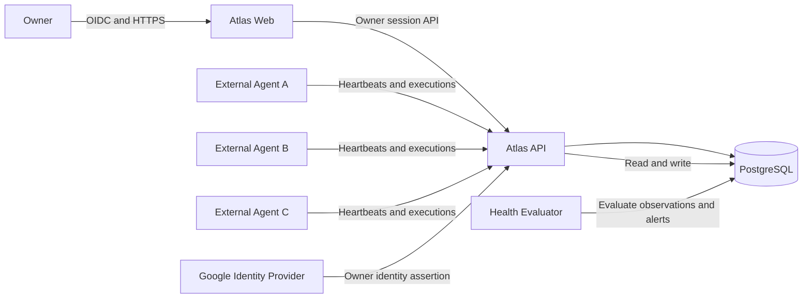

# Agent Visibility MVP Target Architecture

**Status:** Active Architecture Baseline
**Version:** 1.0
**Date:** 2026-07-23
**Governing Decisions:** `ADR-008` and `ADR-009`

## 1. Purpose

This document is the canonical architecture baseline for the active Atlas MVP.
It replaces the original execution-platform assumptions where they conflict
with ADR-008 or ADR-009.

Legacy architecture documents remain available for historical and future
capability reference. They do not override this baseline.

## 2. Architecture objective

Atlas provides identity, trust lifecycle, visibility, health evaluation,
alerts, and retained operational history for agents running outside Atlas.

The architecture supports independently implemented agents without requiring
Atlas to host their code, know their internal framework, reach their network,
control their scheduler, hold their provider credentials, execute their tools,
or understand their business payloads.

## 3. System boundary

### Inside Atlas

- Owner authentication and session
- Agent registration
- Agent credential lifecycle
- Telemetry authentication and ingestion
- Heartbeat and execution-summary persistence
- Health evaluation and alert lifecycle
- Activity and audit evidence
- Owner dashboard and read APIs
- PostgreSQL persistence

### Outside Atlas

- Agent source repositories, deployments, processes, schedules, and triggers
- Agent tools, models, business configuration, connectors, and credentials
- Runtime logs beyond bounded reported summaries
- Process start, stop, restart, and removal

## 4. System context



Atlas has no required inbound path to an agent. External agents need only
outbound HTTPS access to Atlas.

## 5. Container architecture

| Container | Responsibility | MVP deployment |
| --- | --- | --- |
| Atlas Web | Owner interface for Overview, Agents, Executions, Alerts, and Activity | Netlify |
| Atlas API | Owner APIs, agent ingestion APIs, authentication, validation, authorization, and projections | Render web service |
| PostgreSQL | Registration, credential metadata, telemetry, derived state, alerts, activity, and audit data | Render PostgreSQL |
| Health Evaluator | Evaluates heartbeat and failure conditions and idempotently transitions health and alerts | Render cron or bounded scheduled process |
| External Agent Runtime | Sends telemetry and owns its code, deployment, tools, schedule, business data, and provider credentials | Outside Atlas |

The MVP does not require an Atlas worker fleet, job-dispatch queue, connector
runtime, LLM runtime, approval service, or outbound webhook worker.

## 6. Component architecture

### 6.1 Owner Identity Service

- Retains the accepted Google OIDC owner boundary.
- Creates, validates, expires, and revokes owner sessions.
- Enforces CSRF and same-origin controls for browser mutations.

### 6.2 Agent Registry Service

- Creates stable agent registrations.
- Owns owner-declared metadata and lifecycle state.
- Exposes active, disconnected, and archived projections.
- Never stores agent runtime code or business secrets.

### 6.3 Agent Credential Service

- Generates high-entropy credentials and returns plaintext once.
- Stores non-reversible verifiers and lookup metadata.
- Binds every credential to one agent and telemetry-write scope.
- Rotates, expires, and revokes credentials.
- Produces redacted audit evidence.

### 6.4 Telemetry Authentication Boundary

- Authenticates the bearer credential before accepting data.
- Verifies that the credential's agent matches the path.
- Rejects disconnected and archived agents.
- Applies rate, payload-size, timestamp, and contract-version controls.

### 6.5 Heartbeat Ingestion Service

- Validates and deduplicates heartbeat events.
- Records server receive time separately from agent time.
- Persists structured, bounded reported checks.
- Updates last-contact projections without allowing registration mutation.

### 6.6 Execution Ingestion Service

- Idempotently creates or updates agent-reported executions.
- Enforces state-transition and immutable-field rules.
- Stores bounded summaries and normalized error codes.
- Never dispatches the reported work.

### 6.7 Health Evaluation Service

- Computes connection health from Atlas receive time.
- Keeps reported health separate from observed health.
- Supports heartbeat and activity-only monitoring modes.
- Performs idempotent health-state transitions.

### 6.8 Alert Service

- Opens, deduplicates, updates, acknowledges, and resolves alerts.
- Associates alerts with their source condition.
- Automatically resolves recoverable health conditions.
- Does not treat acknowledgment as condition resolution.

### 6.9 Activity Projection

- Presents material lifecycle and operational changes in owner language.
- Reads from domain events and durable audit evidence.
- Excludes noisy ordinary dashboard reads.

### 6.10 Audit Writer

- Records security and material lifecycle evidence.
- Preserves actor, agent, action, result, reason, timestamp, and correlation.
- Redacts credentials and rejected sensitive payload values.
- Remains append-oriented.

## 7. Trust boundaries

### 7.1 Browser to Atlas

The browser is untrusted. Owner routes require the accepted OIDC-backed
session, secure cookies, authorization, CSRF protection for mutations, output
encoding, and correlation.

### 7.2 Agent to Atlas

Every external agent is an independent untrusted workload. A valid credential
establishes only the Atlas agent identity and permission to write the accepted
telemetry types for that identity.

It does not establish that the agent is uncompromised, its checks are truthful,
its business result is correct, its external process has stopped, or its
environment and version claims are accurate. Atlas labels reported state and
computes observed state separately.

### 7.3 API and evaluator to database

Only Atlas services access the database. Persistence uses bounded
transactions, migrations, and least-privilege credentials. The evaluator reads
eligible observations and writes derived health and alert transitions. It does
not hold agent credentials and cannot call agents.

## 8. Data architecture

### 8.1 Active entities

| Entity | Essential fields |
| --- | --- |
| `agents` | ID, slug, name, description, environment, monitoring mode, heartbeat expectation, lifecycle, tags, references, expected version, timestamps |
| `agent_credentials` | ID, agent ID, verifier, status, created, expires, last used, rotated, revoked |
| `agent_heartbeats` | ID, agent ID, event ID, sent time, received time, version, build, environment, reported status, structured checks |
| `agent_executions` | ID, agent ID, external execution ID, state, trigger, timestamps, duration, summary, error code, correlation, version/build |
| `agent_health` | Agent ID, observed state, reported state, evaluated time, last contact, next threshold, source |
| `alerts` | ID, agent ID, source type/ID, condition key, severity, status, first/last seen, acknowledged/resolved times |
| `activity_events` | ID, agent ID, type, actor, result, reason, correlation, material metadata, timestamp |
| `audit_events` | Existing durable security and governance evidence |
| `owner_sessions` | Existing owner session state |

### 8.2 Source-of-truth rules

- Atlas owns registration, credential, lifecycle, accepted receipt, derived
  health, alert, activity, and audit state.
- The agent owns the report it sends; Atlas stores it as a report, not proven
  external truth.
- The external hosting platform owns process and deployment truth.
- Atlas does not duplicate provider business content.

### 8.3 Existing tables

Existing queue, schedule, approval, connector, knowledge, Gmail, webhook,
artifact, and related tables are not dropped as part of the direction reset.
They remain dormant until an accepted migration Work Order proves safe
retention or removal.

## 9. Health model

Lifecycle:

```text
pending | connected | disconnected | archived
```

Observed connection health:

```text
never_seen | online | late | offline | not_monitored
```

Reported health:

```text
unknown | healthy | degraded | unhealthy
```

For heartbeat-monitored agents:

- `online`: last accepted receipt is within the expected interval plus normal
  tolerance;
- `late`: the normal interval is missed but the offline threshold is not;
- `offline`: the offline threshold is exceeded;
- `never_seen`: no accepted heartbeat exists;
- `not_monitored`: lifecycle or monitoring mode does not permit evaluation.

The evaluator uses server receive time. A future-dated agent timestamp cannot
keep an agent online.

Activity-only agents show last contact and last execution without a continuous
liveness claim.

## 10. Alert model

An alert condition has a stable condition key so repeated evaluations update
one alert rather than creating duplicates.

Initial conditions:

- missed heartbeat;
- unhealthy or failed reported check;
- repeated execution failure;
- expected-version mismatch;
- environment mismatch;
- repeated rejected ingestion attempts.

Alert state:

```text
open -> acknowledged -> resolved
```

Acknowledgment does not resolve the underlying condition.

## 11. API architecture

| Consumer | Authentication | Capabilities |
| --- | --- | --- |
| Owner dashboard | OIDC-backed owner session and CSRF for mutations | Enrollment, reads, metadata, rotation, disconnect, archive, alert acknowledgment |
| External agent | Per-agent bearer credential | Write heartbeat and execution telemetry for the bound agent only |

The existing external-product-client HMAC routes are not reused as agent
identity. Dormant routers may remain mounted only during a documented
transition and must not appear as active product capabilities.

The canonical route and schema contract is
`docs/specifications/agent-integration-api.md`.

## 12. Deployment architecture

The current Netlify, Render API, and Render PostgreSQL deployment may be
retained.

The health evaluator begins as the smallest independently invokable scheduled
process that uses the existing settings model, acquires a database-backed
lease, processes bounded batches, is safe to rerun, emits structured evidence,
and has no external-agent network access.

No queue or long-running worker is required unless measured load demonstrates
the need.

## 13. Security controls

- TLS for all non-local traffic.
- High-entropy, per-agent credentials.
- One-time credential display and non-reversible storage.
- Credential lookup separated from verifier comparison.
- Path identity bound to authenticated agent identity.
- Request size, field length, list count, rate, and timestamp bounds.
- Idempotency and conflicting-replay detection.
- Secret-pattern rejection and metadata-only audit.
- Owner-only credential mutation.
- Immediate rejection after disconnect or archive.
- No agent read scope in the MVP.
- No credential, prompt, document, message, or arbitrary log persistence.

## 14. Observability

Platform metrics include:

- accepted and rejected heartbeat and execution counts;
- authentication failures and ingestion latency;
- evaluator duration and lag;
- agents by lifecycle and observed health;
- alerts by severity and condition;
- credential rotation and revocation outcomes;
- database and API readiness.

Every ingestion request has a correlation identity and authenticated agent
identity. Logs do not include bearer credentials or full request bodies.

## 15. Availability and failure behavior

- Atlas outage: agents retry bounded execution updates and send the newest
  heartbeat after recovery.
- Agent outage: Atlas transitions from online to late to offline and opens one
  missed-heartbeat alert.
- Evaluator outage: dashboards expose stale evaluation and platform monitoring
  alerts on evaluator lag.
- Credential compromise: the owner rotates or disconnects.
- Clock skew: server receipt controls liveness.
- Duplicate delivery: event and execution identities prevent duplicate state.

## 16. Active UI

| Surface | Responsibility |
| --- | --- |
| Overview | Fleet connection summary, open alerts, recent failures, and enrollment prompt |
| Agents | Searchable lifecycle and health inventory; enroll action |
| Agent Detail | Identity, connection, reported health, version/build, executions, alerts, activity, rotate/disconnect/archive |
| Executions | Read-only agent-reported execution inventory and detail |
| Alerts | Open, acknowledged, and resolved operational conditions |
| Activity | Read-only material lifecycle and operational history |

## 17. Deferred architecture

The following require a new or reactivated decision, specification, and
implementation authority:

- Atlas-directed agent commands, runtime deployment, schedules, or manual runs;
- connectors, provider credentials, approvals, policies, artifacts, or
  knowledge;
- outbound webhooks, streaming telemetry, or trace ingestion;
- multi-user or multi-tenant operation;
- agent SDK distribution.

## 18. Migration principles

- Do not delete historical evidence.
- Do not roll back applied production migrations merely to simplify the model.
- Add normalized tables and migrate only data with a valid target meaning.
- Quarantine synthetic records from normal production views.
- Keep dormant routes and pages visibly inactive until removed under a bounded
  Work Order.
- Preserve rollback paths for every deployment change.
- Never imply that historical synthetic runs became external executions.

## 19. Verification expectations

The architecture is proven only when:

- three independent client implementations pass the same contract tests;
- cross-agent credential attempts fail;
- heartbeats drive deterministic health transitions;
- execution updates are idempotent and reject regressions;
- alerts deduplicate and recover;
- rotate, disconnect, reconnect, and archive preserve their invariants;
- the active UI contains no simulated operational controls;
- synthetic seed data is not required for normal hosted use.
