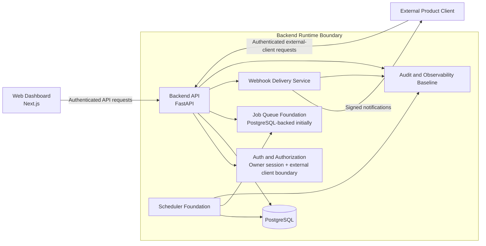

# Phase 3 Platform Foundation Target Architecture

**Status:** Draft - Planning Review Required
**Owner:** Repository Maintainer
**Date:** 2026-07-17
**Implementation Authorization:** Not Granted
**Decision Register:** [Phase 3 Implementation Decision Register](./phase-3-implementation-decision-register.md)

---

## 1. Purpose

Describe the target architecture Phase 3 should reach before Phase 5 Agent
Framework and Phase 6 Gmail Agent implementation begins.

This document coordinates existing canonical architecture. It does not replace
the architecture documents under `docs/architecture/`.

## 2. Architecture Principles

Phase 3 must preserve:

- control plane before execution plane;
- planned decisions before provisioning or implementation;
- PostgreSQL as runtime system of record;
- authentication required by default;
- authorization denied by default;
- external-client authentication separate from human-owner attribution;
- webhook events as notifications, never authorization;
- structured errors and correlation IDs on all API boundaries;
- no secrets in source, logs, webhooks, API responses, or test fixtures;
- no Phase 5 knowledge behavior or Phase 6 Gmail behavior.

## 3. Target Container View

## 4. Backend Runtime Boundary

The backend runtime owns:

- app startup and settings;
- environment validation;
- database connections;
- migrations;
- health and readiness;
- request correlation;
- structured API errors;
- dependency lifecycle;
- OpenAPI grouping and route versioning.

The runtime must not own:

- frontend session UI;
- Gmail connector operations;
- agent business logic;
- production deployment cutover unless separately authorized.

## 5. Infrastructure Provisioning Architecture

The canonical architecture selects Netlify for the dashboard and Render for the
backend runtime boundary, including Render Web Service, Render Background
Workers, Render Cron Job, and Render PostgreSQL. Phase 3 planning should retain
that target unless a future accepted ADR changes it.

Before any live infrastructure is provisioned, an accepted Work Order must
document:

- provisioning mechanism: manual provider dashboard steps, Render Blueprint,
  Terraform, Pulumi, or another approved approach;
- repository ownership: whether an `infrastructure/` area is introduced and
  what files it owns;
- environment model: local, development, test, staging if any, and production;
- database placement: local/test PostgreSQL path and hosted Render PostgreSQL
  development and production expectations;
- region, tier, backup, retention, and restore expectations appropriate to the
  project stage;
- environment variables and secret ownership;
- migration, rollback, and destructive-operation controls;
- required access controls for provider accounts and service credentials;
- evidence required before production promotion.

Until that Work Order is accepted, implementation agents may prepare local and
CI-compatible configuration only. They must not create live provider resources,
alter production deployment topology, or choose an infrastructure-as-code tool
as part of ordinary coding work.

## 6. Persistence Architecture

Phase 3 persistence expands from WO-015 to include:

- deterministic database URL and engine configuration;
- local development database strategy;
- test database strategy;
- hosted Render PostgreSQL development and production expectations once
  provisioning is explicitly authorized;
- migration command standardization;
- user/session tables required for owner authentication;
- authorization policy scaffolding tables if needed;
- queue job tables;
- scheduler lease or trigger tables;
- webhook subscription and delivery state hardening;
- audit event and operational log persistence conventions.

Data constraints:

- UTC timestamps.
- stable identifiers.
- explicit status fields.
- idempotency keys on state-changing request records.
- no full email bodies.
- no OAuth token plaintext.
- no prohibited knowledge values.

## 7. Authentication Architecture

Phase 3 should establish two authentication boundaries.

### 7.1 Owner Dashboard Boundary

Target:

- one approved owner identity;
- session cookie foundation;
- secure session settings;
- logout and invalidation foundation;
- no multi-user UI or role expansion;
- no frontend integration beyond explicitly authorized work.

### 7.2 External Product Client Boundary

Target:

- authenticated client identity;
- credential rotation-ready storage references;
- request signature or keyed authentication;
- deny-by-default scopes;
- audit provenance that records the external client;
- no attribution of the external client as the human owner.

## 8. Authorization Architecture

Authorization should be implemented as a reusable service boundary that:

- denies by default;
- evaluates resource, action, channel, and actor context;
- separates human owner, dashboard session, external client, and service
  identities;
- supports future approval and knowledge contracts without implementing them
  in Phase 3;
- returns structured denial reasons without leaking sensitive policy internals.

## 9. API Contract Architecture

Phase 3 should standardize API conventions before broad endpoint work:

- `/api/v1` route versioning.
- request and response schema validation.
- structured error envelope.
- correlation ID propagation.
- pagination and filtering conventions.
- idempotency key conventions.
- rate-limit response shape.
- OpenAPI grouping.
- placeholder routes fail closed when a later phase owns behavior.

## 10. Queue and Scheduler Architecture

The initial queue should be PostgreSQL-backed unless a future ADR accepts a
different queue.

Queue target:

- job records with stable IDs;
- status lifecycle;
- idempotency key;
- correlation ID;
- payload references, not sensitive payloads;
- claim/lease behavior;
- retry count and retry schedule;
- dead-letter or terminal failure state.

Scheduler target:

- schedule records;
- due-run query foundation;
- duplicate-trigger prevention;
- trigger audit events;
- no real agent execution beyond creating records or queue jobs.

## 11. Webhook Architecture

Webhook delivery target:

- subscribed event types;
- signed outbound notifications;
- minimum-necessary payloads;
- delivery attempts;
- retry state;
- deduplication identity;
- reconciliation status;
- no authorization semantics.

The receiver must always reconcile authoritative state through the API.

## 12. Observability and Audit Architecture

Phase 3 should establish:

- JSON structured logs;
- correlation IDs across API, scheduler, queue, and webhook flows;
- audit event envelope helper;
- no-secret redaction tests;
- health/readiness status conventions;
- metrics placeholders where needed without adding a full monitoring platform.

Audit and logs must remain separate concerns.

## 13. Phase 5 Handoff Requirements

Before Phase 5 begins, Phase 3 must provide:

- stable backend runtime and DB foundations;
- auth and authorization boundaries;
- API conventions;
- webhook delivery foundations;
- audit and observability conventions;
- queue/scheduler foundations;
- documented residual risks;
- no hidden operational knowledge behavior.

Phase 5 then owns governed fact CRUD, fact confirmation, volatility,
questions/answers, approval evidence `facts_used`, and contract behavior.
